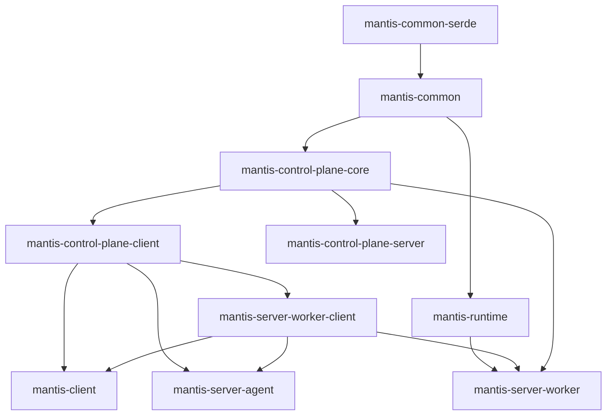

# 

[](https://travis-ci.com/Netflix/mantis)
[](https://github.com/Netflix/mantis)
[](https://www.apache.org/licenses/LICENSE-2.0)

## Mantis Documentation

[https://netflix.github.io/mantis/](https://netflix.github.io/mantis/) 

## Development

### Setting up Intellij
Run `./gradlew idea` to (re-) generate IntelliJ project and module files from the templates in `.baseline`. The
generated project is pre-configured with Baseline code style settings and support for the CheckStyle-IDEA plugin.

### Building

```sh
$ ./gradlew clean build
```

### Testing

```sh
$ ./gradlew clean test
```

### Formatting the code
Run `./gradlew format` task which autoformats all Java files using [Spotless](https://github.com/diffplug/spotless).

### Building deployment into local Maven cache

```sh
$ ./gradlew clean publishNebulaPublicationToMavenLocal
```

### Releasing

We release by tagging which kicks off a CI build. The CI build will run tests, integration tests,
static analysis, checkstyle, build, and then publish to the public Bintray repo to be synced into Maven Central.

Tag format:

```
vMajor.Minor.Patch
```

You can tag via git or through Github's Release UI.

## Contributing

Mantis is interested in building the community. We welcome any forms of contributions through discussions on any
of our [mailing lists](https://netflix.github.io/mantis/community/#mailing-lists) or through patches.

For more information on contribution, check out the contributions file here:

- [https://github.com/Netflix/mantis/blob/master/CONTRIBUTING.md](https://github.com/Netflix/mantis/blob/master/CONTRIBUTING.md)

### Module Structure
This excludes all connectors and examples as they are mostly leaf nodes in the dependency graph. 

module                      | purpose                                                                                                               | examples                                                                   | packageprefixes
----------------------------|-----------------------------------------------------------------------------------------------------------------------|----------------------------------------------------------------------------|--------------------------------------------------------------------------------------------------------------------------------
mantis-common-serde         | json serializer/deserializer                                                                                          | JsonSerializer                                                             | io.mantisrx.common.*
mantis-discovery-proto      | not sure                                                                                                              | JobDiscoveryProto,AppJobClustersMap,StageWorkers                           | com.netflix.mantis.discovery.proto.*
mantis-common               | all mantis common code shared across modules                                                                          | MantisJobDefinition,MachineDefinition,MantisJobState                       | io.mantisrx.common.*,io.mantisrx.runtime.*,io.mantisrx.server.code.*,io.reactivx.mantis.operators.*,com.mantisrx.common.utils.*
mantis-remote-observable    | connection to other job,stage related code                                                                            | ConnectToObservable,ConnectToGroupedObservable,RemoteObservable            | io.reactivex.mantis.remote.observable.*,io.reactivex.netty.codec.*
mantis-control-plane-core   | common code between mantis-control-plane-server, mantis-control-plane-client,mantis-server-worker,mantis-server-agent | TaskExecutorID,ClusterID,ExecuteStageRequest,JobAssignmentResult,Status    | io.mantisrx.server.core.*,io.mantisrx.server.master.resourcecluster.*,io.mantisrx.server.worker.*
mantis-control-plane-client | API to talk to the mantis control plane server                                                                        | MasterClientWrapper,MantisMasterGateway,MantisMasterClientApi              | io.mantisrx.server.master.client.*,io.mantisrx.server.master.resourcecluster.*
mantis-network              |                                                                                                                       |                                                                            |
mantis-publish-core         |                                                                                                                       |                                                                            |
mantis-server-worker-client | API to interact with workers                                                                                          | MetricsClient, MetricsClientImpl,WorkerConnection,WorkerMetricsClient      | io.mantisrx.server.worker.client.*
mantis-runtime              | Runtime that the jobs need to depend upon. Job DSL should go in here along with how to talk to other jobs, etc...     | KeyToKey,GroupToGroup,Source,Sink                                          | io.mantisrx.runtime.*
mantis-publish-netty        |                                                                                                                       |                                                                            |
mantis-client               | client to interact with mantis control plane                                                                          | submitJob, connectToRunningJob                                             | io.mantisrx.client.*
mantis-publish-netty-guice  |                                                                                                                       |                                                                            |
mantis-control-plane-server | Actual server that runs the mantis master code                                                                        | MasterMain,SchedulingService,ServiceLifecycle                              | io.mantisrx.master.*.io.mantisrx.server.master.*
mantis-server-agent         | Contains mantis-runtime agnostic code to start the task executor that runs on the agent                               | TaskExecutor,TaskExecutorStarter,BlobStore,BlobStoreAwareClassLoaderHandle | io.mantisrx.server.agent.*
mantis-server-worker        | One implementation of Mantis Worker that depends on the master runtime                                                | MantisWorker,Task,ExecuteStageRequestService,JobAutoScaler                 | io.mantisrx.server.worker.config.*,io.mantisrx.server.worker.jobmaster.*

### Dependency Graph


