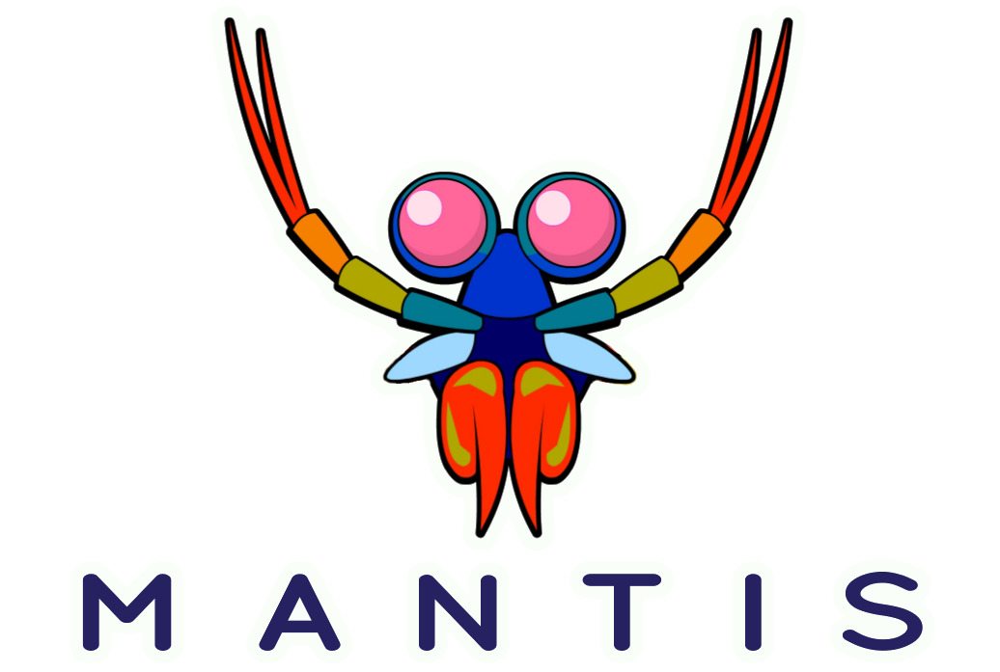
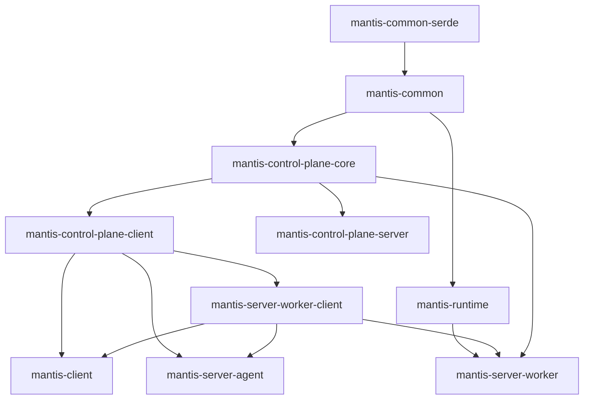

# Mantis Documentation


[](https://travis-ci.com/Netflix/mantis)
[](https://github.com/Netflix/mantis)
[](https://www.apache.org/licenses/LICENSE-2.0)


[Official Website](https://netflix.github.io/mantis/) 

---

## Development

### Setting up Intellij
Run `./gradlew idea` to (re-) generate IntelliJ project and module files from the templates in `.baseline`. The generated project is pre-configured with Baseline code style settings and support for the CheckStyle-IDEA plugin.

### Install Docker
Install and run Docker to support local containers.

### Building

```sh
$ ./gradlew clean build
```

### Testing

```sh
$ ./gradlew clean test
```

### Formatting the code
Run `./gradlew format` task which autoformats all Java files using [Spotless](https://github.com/diffplug/spotless).

### Building deployment into local Maven cache

```sh
$ ./gradlew clean publishNebulaPublicationToMavenLocal
```

### Releasing

We release by tagging which kicks off a CI build. The CI build will run tests, integration tests,
static analysis, checkstyle, build, and then publish to the public Bintray repo to be synced into Maven Central.

Tag format:

```
vMajor.Minor.Patch
```

You can tag via git or through Github's Release UI.

## Contributing

Mantis is interested in building the community. We welcome any forms of contributions through discussions on any
of our [mailing lists](https://netflix.github.io/mantis/community/#mailing-lists) or through patches.

For more information on contribution, check out the contributions file [here](https://github.com/Netflix/mantis/blob/master/CONTRIBUTING.md).


### Module Structure
This excludes all connectors and examples as they are mostly leaf nodes in the dependency graph. 

Module                      | Purpose                                                                                                                 | Example Classes                                                                                             | Package Prefixes
----------------------------|-------------------------------------------------------------------------------------------------------------------------|-------------------------------------------------------------------------------------------------------------|---------------------------------------------------------------------------------------------------------------------------------------------------------------------
mantis-common-serde         | Support for serializing and deserializing POJOs using Json                                                              | <li>JsonSerializer</li>                                                                                     | <li>io.mantisrx.common.*</li>
mantis-discovery-proto      | todo: need to fill this in                                                                                              | <li>JobDiscoveryProto</li><li>AppJobClustersMap</li><li>StageWorkers</li>                                   | <li>com.netflix.mantis.discovery.proto.*</li>
mantis-common               | Mantis common code shared across modules                                                                                | <li>MantisJobDefinition</li><li>MachineDefinition</li><li>MantisJobState                                    | <li>io.mantisrx.common.\*</li><li> io.mantisrx.runtime.\*<li>io.mantisrx.server.code.\*</li><li>io.reactivx.mantis.operators.\*</li><li>com.mantisrx.common.utils.\*
mantis-remote-observable    | connection to other job,stage related code                                                                              | <li>ConnectToObservable</li><li>ConnectToGroupedObservable</li><li>RemoteObservable                         | <li>io.reactivex.mantis.remote.observable.\*</li><li>io.reactivex.netty.codec.\*<li>
mantis-control-plane-core   | common code between mantis-control-plane-server, mantis-control-plane-client, mantis-server-worker, mantis-server-agent | <li>TaskExecutorID</li><li>ClusterID</li><li>ExecuteStageRequest</li><li>JobAssignmentResult</li><li>Status | <li>io.mantisrx.server.core.\*</li><li>io.mantisrx.server.master.resourcecluster.\*</li><li>io.mantisrx.server.worker.\*
mantis-control-plane-client | API to talk to the mantis control plane server                                                                          | <li>MasterClientWrapper</li><li>MantisMasterGateway</li><li>MantisMasterClientApi                           | <li>io.mantisrx.server.master.client.\*<li> io.mantisrx.server.master.resourcecluster.\*
mantis-network              | todo: need to fill this in                                                                                              |                                                                                                             |
mantis-publish-core         | todo: need to fill this in                                                                                              |                                                                                                             |
mantis-server-worker-client | API to interact with workers                                                                                            | <li>MetricsClient</li><li> MetricsClientImpl</li><li>WorkerConnection</li><li>WorkerMetricsClient           | <li>io.mantisrx.server.worker.client.\*
mantis-runtime              | Runtime that the jobs need to depend upon. Job DSL should go in here along with how to talk to other jobs               | <li>KeyToKey</li><li>GroupToGroup</li><li>Source</li><li>Sink                                               | <li>io.mantisrx.runtime.\*
mantis-publish-netty        | todo: need to fill this in                                                                                              |                                                                                                             |
mantis-client               | client to interact with mantis control plane                                                                            | <li>MantisClient::submitJob</li><li> MantisClient::killJob                                                  | <li>io.mantisrx.client.*</li>
mantis-publish-netty-guice  | todo: need to fill this in                                                                                              |                                                                                                             |
mantis-control-plane-server | Actual server that runs the mantis master code                                                                          | <li>MasterMain</li><li>SchedulingService</li><li>ServiceLifecycle                                           | <li>io.mantisrx.master.\*<li>io.mantisrx.server.master.\*
mantis-server-agent         | Contains mantis-runtime agnostic code to start the task executor that runs on the agent                                 | <li>TaskExecutor</li><li>TaskExecutorStarter</li><li>BlobStore</li><li>BlobStoreAwareClassLoaderHandle      | <li>io.mantisrx.server.agent.\*
mantis-server-worker        | One implementation of Mantis Worker that depends on the master runtime                                                  | <li>MantisWorker</li><li>Task</li><li>ExecuteStageRequestService<li>JobAutoScaler                           | <li>io.mantisrx.server.worker.config.\*<li>io.mantisrx.server.worker.jobmaster.\*

### Dependency Graph


