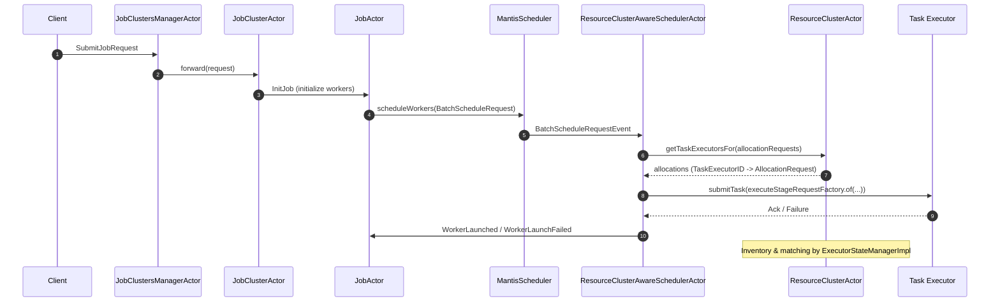
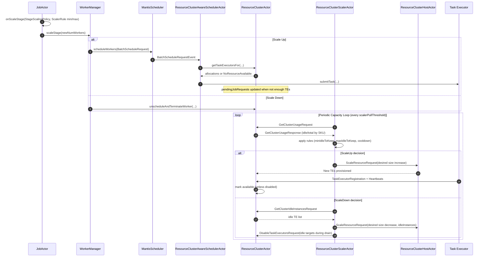

# Scheduling Logic and Resource Cluster Interactions

This document explains how job creation and job scaling translate into scheduling and resource changes, and how those changes interact with the Resource Cluster and the Resource Cluster Scaler.

## A) Job Creation → Scheduling → Task Execution

Key notes:
- Job submission enters at `JobClustersManagerActor.onJobSubmit`, forwarded to `JobClusterActor`, then `JobActor.initialize` constructs workers.
- `JobActor` enqueues workers via batch scheduling to the resource-cluster-aware scheduler.
- `ResourceClusterAwareSchedulerActor` queries `ResourceClusterActor` for best-fit executors and pushes tasks to TEs via `TaskExecutorGateway`.

## B) Job Stage Scale-Up/Down and Resource Cluster Scaler Loop

Key notes:
- Job scale-up adds workers; if TEs are insufficient, the scheduler records demand (pending) so the scaler sees fewer effective idle slots and scales up capacity.
- Scale-down removes workers and may free idle TEs; the scaler can shrink capacity by selecting idle instances to drain and disabling them during deprovisioning.

## Code Reference Map

- Submission & job initialization:
  - `JobClustersManagerActor.onJobSubmit(...)`
  - `JobActor.onJobInitialize(...)`, `initialize(...)`, `submitInitialWorkers(...)`, `queueTasks(...)`

- Scheduling (push model):
  - `ResourceClusterAwareSchedulerActor.onBatchScheduleRequestEvent(...)`, `onAssignedScheduleRequestEvent(...)`
  - `ResourceClusterActor` + `ExecutorStateManagerImpl.findBestFit(...)`, `findBestGroupBySizeNameMatch(...)`, `findBestGroupByFitnessCalculator(...)`

- Job scaling:
  - `JobActor.onScaleStage(...)` → `WorkerManager.scaleStage(...)`

- Resource-cluster autoscaling:
  - `ResourceClusterScalerActor.onTriggerClusterUsageRequest(...)`, `onGetClusterUsageResponse(...)`, `onGetClusterIdleInstancesResponse(...)`
  - `ExecutorStateManagerImpl.getClusterUsage(...)` (idle = available − pending), `pendingJobRequests`
  - `ResourceClusterActor.onTaskExecutorRegistration(...)` (TE joins, becomes available)

## Coupling Between Scheduling and Scaling

- When allocations fail due to lack of capacity, the resource cluster records pending demand per job/group; the scaler subtracts this pending from available to compute effective idle, triggering scale-up.
- New TEs register with the resource cluster and are immediately considered for subsequent scheduling waves.
