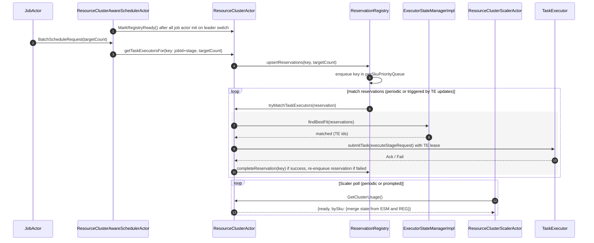
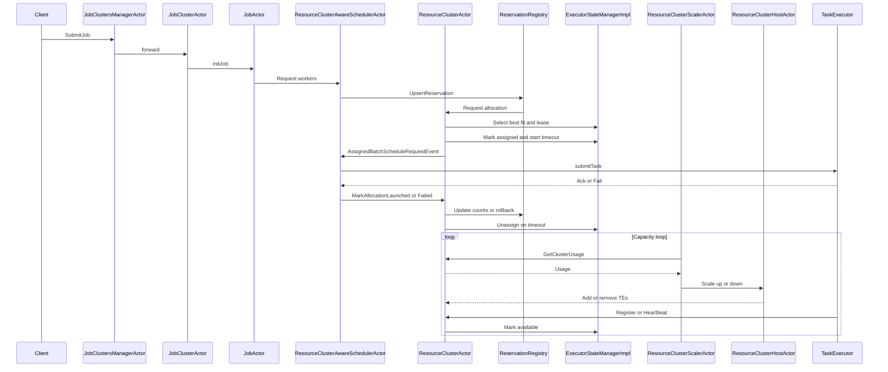

# Plan: Support Reservation-based Task Executors Scheduling
The objective here is to introduce a reservation registry in resource cluster and scheduler to be able to handle reliable batched scheduling for job workers to be allocated to task executors (TE).
Current Problems to be solved:
- Only support batch mode in new job creations but not job scaling.
- Unreliable cache tracking on scheduling requests.
- Resource scaling is not efficient and cannot handle large scale concurrent job scaling operations.

## Design: Reservation-based Scheduling
### Scenarios to handle
- Starvation/blocking from single large requests. On new job submission this should remain as strict batch. On scaling scenario there are tradeoffs to be made. We can stick to strict batching (so it's same as new job) or allow partial batch to be fulfilled (in multi-job scaling situations this can make the allocation process more fair and less unexpected blocking).
- Cascading scaling requests from same job needs to be deduped.
- Error recovery: if something went wrong in a job/reservation and block the whole pipeline, we need some ways to break the gridlock. options include (not ideal: restart leader to re-construct registry), (failed reservation is re-prioritized and move to the end of the queue), (api to force a reset).

### Options
- Strict batching (immutable reservation). Use detailed metrics to see the pending status. Support cancellation on reservations fully wired into job action (kill, scale down). Simpler mechanism, less error prone but won't handle extreme case where large batch starving everyone else.
- Mutable batching: allow partial batch update to be made to reduce locking from a large batch to give more faireness but added more complexity and error prone to the system.

Thoughts: strict batching is preferred to reduce risk and complexity for now while we can try keep most interfaces open to both modes.

## Terminology
- Task Executor (TE): agent host registered to control plane from one of the resource clusters with a pre-defined container spec. Can be assigned job worker.
- Worker: a worker in one of a job's stage. A job can have multiple stages and each stage will have a list of workers with worker index and worker number to id each one. JobActor is responsible to keep track of the workers and inform scheduler to add/remove workers from scaling/creation/deletion operations.
- ESM (executor state manager): class in ResourceClusterActor tracking TE status (registration and heartbeats).

### Action List v2
[Direction] use strict batching mode only. keep current code path as fallback with config options.

- Reservation: one reservation instance represents one job's given stage's request to allocate/assign TEs. The assumption here is in one stage the scheduling constraint should be the same for all workers/TEs. For a given request from the JobActor, the reservation can be constructed to include the list of worker's TaskExecutorAllocationRequest and also the total target size for the given stage.
    - The reservation should use total target stage size + request worker list to help determine: dedupe requests, determining whether the request is for a new job vs a scaling request.
    - On new job (total target stage size == worker request list size), the reservation fullfillment should not allow partial allocation.
    - On scaling request, partial allocation is also not allowed.

- ReservationRegistry: add `ReservationRegistry` owned by `ResourceClusterActor`
  - Types: `ReservationKey(jobId, stageNum)`, `Reservation{ReservationKey, canonicalSchedulingConstraint, workerRequests, stageTargetSize, lastUpdatedAt, priorityEpoch}`
  - Indexes: `reservationsByKey`, `perSchedulingConstraintPriorityQueue` ordered by `(priorityEpoch desc)`. (make sure there is proper GC on these index)
  - API (actor message behavior): 
    -- `upsertReservations`: recevied from JobActor/Scheduler. insert if new. If there is existing key, replace the old reservation.
    -- `completeReservation`: mark a reservation to be completed. Remove index entries.
    -- `cancelReservation`: cancel an existing reservation. Remove from index tables.
    -- `getPendingReservationsBySchedulingConstraints`: return a map of summary of pending reservations grouped by reservation's schedulingConstraint.
    -- `markReady`: signal from external actors to indicate the registry has received all the state (init messages) from job actors. This is important since a partial pending result to resource cluster actor and scaler can interrupt ongoing provisoin tasks during a leader switch.
  - Behavior:
    - same reservation request doesn't change existing reservation priority.
    - init: return not ready from getPendingReservationsBySchedulingConstraints until ready signal from schduler factory.
    - reservation priority: default on request epoch; override to (0/1/2 etc. on manual overide e.g. replace worker request). Leave interface to add custom logic in future too.
    - same key (jobId + stageNum) with different stage target size: dedupe logic (ignore same target size && same worker request size. Replace old request with new one if target size changed).
    - reservation class should be immutable. Replace exisitng if needed.
    - internal loop to process reservation queue: timer + ESM signal (need to be mini-batch style to avoid too many trigger from ESM).
    - abstract and config to support different priority behavior. Default strategy setup to use epoch time on creation + override signal (e.g. priorityEpoch as 0)
    - main processing logic: when reservation registry try to process the active reservations, it should go through the priority (so it honors the priority). Start with top of the queue of each "size" or "sku", check if the reservation can be fulfilled (matched) from executor state manager. Once matched, invoke resource cluster actor to do the actual assignement to TEs and finish (remove) the reservation in registry. If the target reservation cannot be matched, stop the process on this queue. Proceed to next reservation if the top one is successfully filled, otherwise stop (only top of the queue shall be processed). Error in assigning TEs tasks should be properly handled such that it moves the reservation to the tail of the queue (re-assigned priority).
    - (optional) new reservation trigger resource cluster scaler process.
(wip marker)
- ResourceClusterActor: integrate registry with matching and TE lifecycle
  - Integrate registry calls: getTaskExecutorFor from scheduler; getUsage from RC scaler (combine state from ESM and registry).
  - Delegate calls to registry and calls between registry and ExecutorStateManager
  - Support Assignement function (currently in scheduler actor) to schedule assignments to TEs and failure handling (update reservation).

- ExecutorStateManagerImpl: keep the original findBestFit part unchanged
   and build a new method named "tryAllocateTaskExecutors(ReservationAllocationRequest request, boolean
  allowsPartialMatch), which does similar operation as findbestFit except that ReservationAllocationRequest directly represents a reservation so the scheduling constraints in this request is the same for all of the workers inside.

- Scheduler: simplify and become stateless on pending
  - Extend `BatchScheduleRequest` to each job stage's target size.
  - On schedule: keep the same `getTaskExecutorsFor` call to RC but no longer expect the allocation result. Only retry if RC returns a failure message indicating reservation insert failed.
  - On assignment: no longer responsible to call TE for assignment (now handled directly inside RC).
  - On leader init: in scheduler factory wait for `JobActor`s init, then call `markRegistryReady()` to RC.

- Autoscaler coupling and readiness
  - RC usage response: `{ready:boolean, bySku: {available, pending, idle=available-pending}}`; still exclude disabled from `available`
  - Scaler ignores scale-down while registry not ready; optionally prompt scaler when `pending` reservations increases materially

- API contracts to add/confirm
  - RC: `scheduleFor(allocationRequestsWithKey)` → upsert+ack to replace current `getExecutorsFor*` APIs.
  - Scheduler Factory → RC: `MarkRegistryReady`

- Observability & ops
  - Metrics: track state in reservation registry (size, pending, actions). Metrics on usage result to scaler.
  - Structured logs for upserts, assignment decisions, submit outcomes, readiness transitions

- Recovery, flags, and rollout
  - Feature-flag the registry path; retain fallback to current behavior; Add depreaction annotation and notes to old code path that can be removed later.
  - Ensure idempotent upserts and submit result handling; timeouts recover assigned-but-unlaunched

- Tests
  - Unit: registry APIs and state transition.
  - Unit: ESM lease/assign/unassign/timeout invariants
  - Integration: multi-reservation handling, failed TE assignements, init behavior, RC restart with scheduler replay, scaler polling with readiness gating

### Edge cases
- JobActor/Scheduler retries: ensure handling if JobActor/Scheduler trigger retry on scheduling requests, proper handling and dedupe on reservations.

### Reservation-based Scheduling v2.1 (Mermaid)

## [Depreacted] Draft 1: Reservation-First Push Design

### Reservation-First Push Sequence

### Scheduler Request Payload Change (Required)

- Update `JobActor → Scheduler: BatchScheduleRequest` to carry the reservation-relevant state for dedupe and quick convergence:
  - `targetCount` for the (jobId, stageNum, skuId) key as of this request
  - `launchedCount` known by JobActor (optional; if omitted, scheduler/RC infers from active workers)
- The scheduler will upsert these values into the `ReservationRegistry` before (or alongside) calling the existing allocation path. This allows the registry to coalesce rapid scale changes and avoid double-counting pending demand.

## ReservationRegistry (Reuse-Path) Design

Purpose
- Provide a precise, deduped ledger of demand for autoscaling and visibility while reusing the existing scheduling/assignment flow unchanged.

Key types
- **ReservationKey**: `(jobId, stageNum, skuId)` where `skuId` matches the scaler's `usageGroupKey`.
- **Reservation**:
  - `key`: ReservationKey
  - `targetCount`: int
  - `launchedCount`: int
  - `lastUpdatedAt`: long
  - `priority`: long (updated whenever target changes to reorder within sku)
- Derived: `pendingCount = max(0, targetCount - launchedCount)`

Lifecycle and integration
- JobActor emits BatchScheduleRequest to Scheduler with `(targetCount, launchedCount?)` attached.
- Scheduler resolves `skuId`, calls `upsertFromScheduler` (with retries), then proceeds with the existing `getTaskExecutorsFor(...) → submitTask(...)` flow.
- When an `AssignedBatchScheduleRequestEvent` completes without errors for a reservation key, Scheduler calls `completeReservationBatch(key, batchSize)`.
- During leader reinit, Scheduler replays upserts from JobActors and then signals `markReady()` so scaler can trust `pending`.

Autoscaler coupling
- For each `skuId`: `idle = available - pending` where `pending = sum(max(0, targetCount - launchedCount))` from the registry. Because keys use the same `skuId` as the scaler's usage, the computation aligns exactly.

Notes
- No partial allocations are recorded at the reservation layer; it only updates when batches fully succeed. Existing assignment retries, timeouts, and error handling remain unchanged in Scheduler/RC/ESM.
- Priority is updated on every target change to allow newer requests to reorder within the sku queue if/when RC later consults the registry for fairness.

ReservationRegistry Placement

- Recommendation: implement `ReservationRegistry` as a plain component owned by `ResourceClusterActor` (same actor turn), not as:
  - an inner class of `ExecutorStateManagerImpl`, and
  - not a separate actor.

- Rationale:
  - **Separation of concerns**: `ExecutorStateManagerImpl` is TE-centric (registered/available/assigned/disabled); reservations are job-centric (JobId/Stage/GroupKey target/allocated/launched). Keeping them separate preserves clarity and testability.
  - **Atomicity**: Matching requires atomic steps across registry and TE state (lease → assign → start timeout → emit assignment). Owning both within `ResourceClusterActor` preserves atomicity under a single-threaded actor turn.
  - **Lower complexity**: A separate actor would need cross-actor transactions or compensations, readiness choreography, and WAL/idempotency for recovery.

- Practical shape:
  - `ResourceClusterActor` composes:
    - `ReservationRegistry` (maps and per-GroupKey FIFO/priority queues; counters: target, allocated, launched),
    - `ExecutorStateManagerImpl` (existing TE state/selection/lease/assignment/timeout).
  - All updates flow through RC:
    - Upsert/cancel reservation → attempt allocation (best-fit + lease) → mark assigned + start timeout → push to scheduler.
    - Submit ack/fail → update registry counts; on fail/timeout → unassign and return TE to available.
  - Scaler usage: `idle = ESM.available − Registry.pending`, gated by a registry readiness flag on leader startup.
