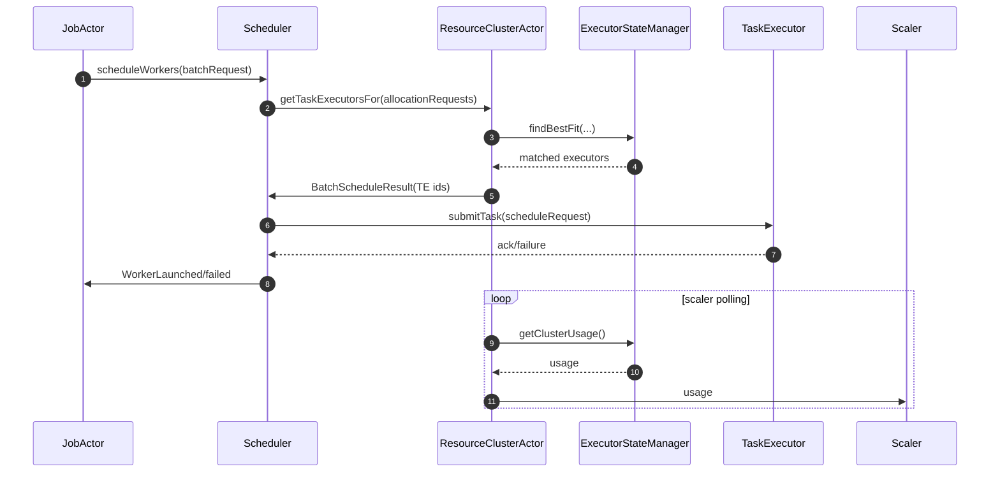
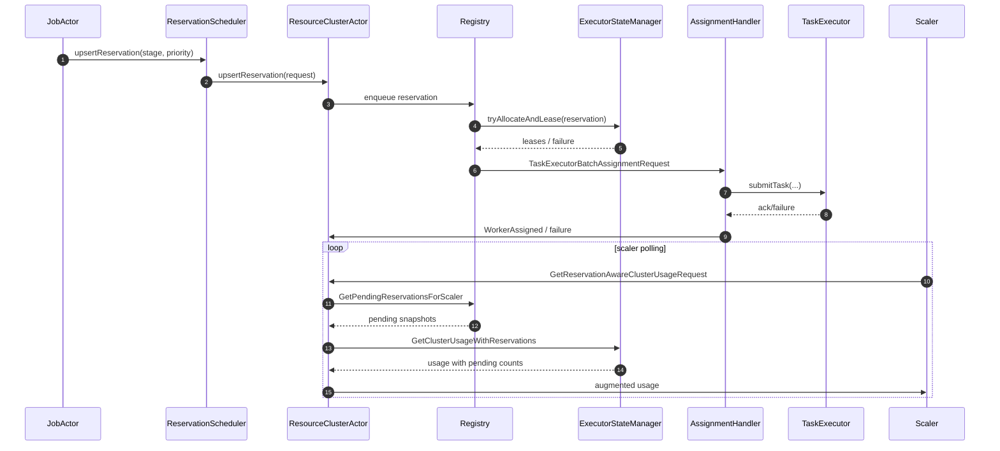

# Reservation Scheduling Context

This change promotes the reservation-based scheduling plan into production-ready behavior across the master, scheduler, resource cluster, and scaler stacks. The goal is to give each job stage a strict, priority-ordered reservation that the control plane owns end‑to‑end so that batching, failures, autoscaling, and retries can be reasoned about holistically.

## Key behavioral shifts
- **Job → Scheduler → Resource Cluster handoff** now happens through `UpsertReservation`/`CancelReservation` envelopes (see `context/plan-reservation-scheduler-integration.md`). The `JobActor.WorkerManager` groups new workers by stage, builds `TaskExecutorAllocationRequest`s, derives a `ReservationPriority` (REPLACE > SCALE > NEW_JOB), and sends the reservation to whatever scheduler was created by `MantisSchedulerFactoryImpl`.
- `MantisSchedulerFactoryImpl` now branches on `mantis.scheduling.reservation.enabled`. When the flag is `true` (default in `MasterConfiguration`), it wires `ResourceClusterReservationAwareScheduler` instead of `ResourceClusterAwareSchedulerActor`. The new scheduler simply proxies the shared protobuf (`MantisResourceClusterReservationProto`) request straight down to `ResourceCluster.upsertReservation()`/`cancelReservation()` so there is zero type conversion and the scheduler no longer tracks pending allocations itself.
- The scheduler still exposes legacy hooks (`scheduleWorkers`, `unscheduleJob`, `unscheduleAndTerminateWorker`) for the paths that bypass reservations (i.e., when the flag is `false`), but the reservation-aware path now advertises `schedulerHandlesAllocationRetries() == true` because retries live in the registry/assignment actors rather than in the scheduler.

## ResourceCluster + Reservation Registry responsibilities
- `ResourceClusterActor` became a thin router: it now creates child actors for `ReservationRegistryActor`, `ExecutorStateManagerActor`, and `AssignmentHandlerActor` and forwards reservation messages and lifecycle updates to them (`TaskExecutorRegistration`, heartbeats, disable/enable, etc.). Everything else (TE management, usage queries) still goes through the executor state manager.
- The registry (`mantis-control-plane/.../ReservationRegistryActor.java`) keeps one queue per canonical constraint key, enforces FIFO per priority, tracks a single in-flight reservation, and sends `TaskExecutorBatchAssignmentRequest` messages to the parent when a reservation is ready. It auto‑marks itself ready via `MarkReady`/timer, exposes `GetPendingReservationsView` for introspection, and answers `GetPendingReservationsForScaler` with real `SchedulingConstraints` so the scaler can map reservations to SKUs.
- `AssignmentHandlerActor` now handles the RPC-heavy `TaskExecutorAssignmentRequest` lifecycle, reusing `TaskExecutorGateway` futures, enforcing retries, and reporting failures back to `ResourceClusterActor` so the queue can decide whether to requeue a reservation or propagate the failure downstream.
- `ExecutorStateManagerActor`/`ExecutorStateManagerImpl` gained reservation-aware APIs (`GetClusterUsageWithReservationsRequest` → `getClusterUsageWithReservations(...)`) that accept the streamed `PendingReservationInfo` snapshots. They reuse the existing fitness/matching logic to map each reservation back to a `containerSku` and expose `pendingReservationCount` in the `GetClusterUsageResponse.UsageByGroupKey`.

## Autoscaler integration
- `ResourceClusterScalerActor` now accepts `reservationSchedulingEnabled` and, when true, requests `GetReservationAwareClusterUsageRequest`. `ResourceClusterActor` handles this by querying the registry for pending reservations, translating them into `PendingReservationInfo`, and forwarding them to the executor state manager before replying to the scaler.
- `ClusterAvailabilityRule.apply()` operates on the new fields `pendingReservationCount`/`effectiveIdleCount`, so scale-up becomes: `if effectiveIdle < minIdle OR pending > 0 → grow by missing idle + pending`, and scale-down is blocked unless `effectiveIdle > maxIdle`. This keeps the cluster from killing capacity that already has hard reservations behind it (`context/plan-scaler-reservation-integration.md` covers the rationale).

## Configuration + readiness
- `ResourceClusters` now exposes `markAllRegistriesReady()` so `JobClustersManagerActor.initialize()` can signal the registries once every current job cluster has recovered; the default scheduler factory implementation forwards that call to `ResourceClustersAkkaImpl`, which relays `MarkReady.INSTANCE` to every `ResourceClusterActor`.
- The shared proto `MantisResourceClusterReservationProto` holds `ReservationKey`, `ReservationPriority`, `Reservation`, `UpsertReservation`, `CancelReservation`, and `CancelReservationAck`. Every layer (job actor, scheduler, resource cluster, registry, tests) now imports these types, avoiding duplicated classes.
- `ResourceCluster` interface gained `upsertReservation`, `cancelReservation`, and `markRegistryReady` defaults so clients can interact with reservations without leaking actor internals.

## Key classes & actors
- **`JobActor.WorkerManager` (mantis-control-plane-server/src/main/java/.../JobActor.java)** groups worker requests by stage, derives `ReservationPriority`, and serializes the work into `UpsertReservation`/`CancelReservation` calls. It also exposes the delayed reservation timer, handles scaling/resubmit priorities, and cancels pending reservations during shutdown.
- **`ResourceClusterReservationAwareScheduler` & `MantisSchedulerFactoryImpl`** replace the legacy scheduler when `mantis.scheduling.reservation.enabled` is `true`, forwarding the shared proto objects directly to `ResourceClusterAkkaImpl` without duplicating DTOs or tracking pending states.
- **`ResourceClusterActor`** now supervises `ReservationRegistryActor`, `ExecutorStateManagerActor`, and `AssignmentHandlerActor`, forwarding reservation/lifecycle messages, exposing `GetReservationAwareClusterUsageRequest`, and bridging TE lifecycle updates to the child actors while still serving executor queries.
- **`ReservationRegistryActor`** stores per-constraint queues, enforces REPLACE/SCALE/NEW_JOB priority, tracks a single in-flight reservation per SKU, emits `TaskExecutorBatchAssignmentRequest`, and answers scaler snapshots (`GetPendingReservationsForScaler`) with actual `SchedulingConstraints`.
- **`AssignmentHandlerActor`** concentrates the RPC-heavy gateway retries, keeps retry budgets, and reports assignment success/failure back to the parent so the registry can requeue or finish reservations without re-implementing gateway logic.
- **`ExecutorStateManagerActor` / `ExecutorStateManagerImpl`** gained reservation-aware handlers and `getClusterUsageWithReservations()`, mapping pending reservations through `findBestGroupForUsage()`/`mapGroupKeyToSkuViaGroupKeyFunc()` before enriching the `GetClusterUsageResponse`.
- **`ResourceClusterScalerActor`** queries `GetReservationAwareClusterUsageRequest` when enabled, works with `ClusterAvailabilityRule.apply()` to respect `pendingReservationCount`, and gate scale-down decisions behind `effectiveIdleCount`.
- **`ResourceClustersManagerActor` / `ResourceClustersAkkaImpl`** now orchestrate `markAllRegistriesReady()` for every active cluster, which in turn triggers `ResourceClusterActor` → `ReservationRegistryActor` readiness once leader initialization finishes.

## Actor flow comparison

### Legacy scheduling interactions

### Reservation-based interactions

## Testing & verification
- Added focused tests for the new pieces:
  - Reservation path: `ReservationRegistryActorTest`, `ReservationRegistryActorIntegrationTest`, `ReservationRegistryActor` metrics coverage, and `ReservationTest`.
  - Reservation-aware scheduler: `JobActorReservationTests`, `AssignmentHandlerActorTest`.
  - Executor state: `ExecutorStateManagerReservationUsageTests`, scaled behavior: `ReservationScalerIntegrationTests`.
  - End-to-end: `ResourceClusterReservationSchedulerIntegrationTests`.
- Existing scheduler tests (`JobActorSmartRefreshTest`, `JobScaleUpDownTests`, etc.) were updated to exercise the reservation branch so that job scaling, resubmissions, and migration still behave correctly under the new flow.

## References
- `context/archive/reservation/context-scheduling-logic.md` – baseline diagram for job submission/scale loops.
- `context/archive/reservation/plan-reservation-registry-v3.md` – design notes for the registry/assignment duo shown in the Excalidraw.
- `context/archive/reservation/plan-reservation-scheduler-integration.md` – explains how JobActor/WorkerManager talk to the scheduler and registry.
- `context/archive/reservation/plan-scaler-reservation-integration.md` – outlines how the scaler becomes reservation-aware.

