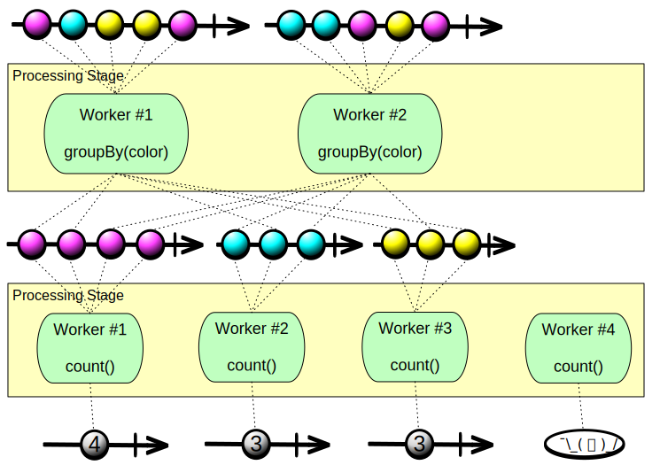

Mantis provides [autoscaling] for the [Cluster] and for each [Job]. You can define a policy for your
Jobs in which they autoscale their resources based on the dynamic needs resulting from variation in
the input data they process. 

This provides two benefits:

1. You can define Jobs to process data without planning ahead for peak usage.
1. Mantis uses cluster resources optimally without leaving resources idle.

## Horizontal Scaling

Your Mantis Jobs are composed of in part of [Processing Stages], with each stage responsible for a
different stream processing task. Because different stages may have different computational needs,
each stage has its own autoscaling policy.

A Processing Stage is further subdivided into [workers]. A worker is the smallest unit of work that
is scheduled. Each worker requests a certain number of CPUs, some amount of memory, and a certain
amount of network bandwidth.

When a Processing Stage scales, the number of workers in that stage increases or decreases (the
resources that Mantis allocates to an individual worker in the stage do not change as a result of
scaling).

## Scaling a Processing Stage Manually

You may define a Processing Stage as scalable without defining an autoscaling policy for it. In such
a case the stage is considered *manually scalable* and you can scale it by means of
[the Mantis UI](mantisui) or the [Mantis API](mantisapi/rest#horizontally-scale-a-stage).

## Setting an Autoscaling Policy

!!! warning
    You should take care that your autoscaling strategies do not contradict each other. For example,
    if you set a CPU-based strategy and a network-based strategy, one may want to trigger a scale-up
    and the other a scale-down at the same time.

You define the autoscaling policy for a Processing Stage by setting the following parameters:

* **Min and Max number of workers** — This sets how many workers Mantis will guarantee to be working
  within the Processing Stage at any particular time.
* **Increment and decrement values** — This indicates how many workers are added to or removed from
  a stage each time the stage autoscales up or down.
* **Cooldown seconds** — This indicates how many seconds to wait after a scaling operation has been
  completed before beginning another scaling operation.
* **Stragtegies** — An autoscaling policy has the following strategy parameters:
    * **Type** — CPU, memory, network, or data drop
    * **Scale down below percentage** — When the average value for all workers falls below this
      value, the stage will scale down. This value is calculated as actual usage divided by
      requested amounts (for data drop, as the number of data items dropped divided by the total
      number of data items, dropped+processed).
    * **Scale up above percentage** — When the average value for all workers rises above this value,
      the stage will scale up.
    * **Rolling count** — This value helps to keep jitter out of the autoscaling process. Instead of
      scaling immediately the first time values fall outside of the scale-down and scale-up
      percentage thresholds you define, Mantis will wait until the thresholds are exceeded a certain
      number of times within a certain window. For example, a rolling count of “6 of 10” means that
      only if in ten consecutive observations six or more of the observations fall below the
      scale-down threshold will the stage be scaled down.

!!! note
    Ideally, there should be zero data drop, so there isn’t an elegant way to express “scale down
    below percentage” for data drop. Specifying “0%” as the “scale down below percentage”
    effectively means the data drop percentage never trigger a scale down. For this reason, it is
    best to use the data drop strategy in conjunction with another strategy that provides the
    scale-down trigger.

The following example shows how you might establish the autoscaling policy for a stage in the Mantis
UI:

The illustration above shows a stage with an autoscaling policy that specifies a minimum of 5 and a
maximum of 20 workers. It uses a single strategy, that of network bandwidth usage.

## Autoscaling Scenarios

There are four varieties of autoscaling scenarios that you should consider for your Mantis Job:

1. The Processing Stage connects to a [cold]  [Source], such as a [Kafka] topic.

    Autoscaling works well for this type of stage (the initial stage in a Job that connects to the
    Source). For example, if your stage connects to a Kafka source, a change in the number of
    workers in the first stage of your Mantis Job causes the Kafka client to redistribute the
    partitions of the topic among the new number of workers.

1. The Processing Stage connects to a hot source, such as a working server.

    The Source stage (stage #1) will have to re-partition the Source servers after an autoscale
    event on the Processing Stage. This is mainly a concern for [Source Jobs]. Upon receipt of a
    modified number of workers, each worker re-partitions the current servers into its own index of
    the new total. This results in a new list of servers to connect to (for both scale up and scale
    down), some of which may be already connected. Making a new connection to a Source server evicts
    any old existing connection from the same Job. This guarantees that no duplicate messages are
    sent to a Mantis Job. (The solution for this scenario is currently in development.)

    Rewrite this; it’s not very clear.

1. The Processing Stage connects to another Mantis Job.

    In this case, the initial Processing Stage in a Job that connects to the output of the previous
    Mantis Job has strong connectivity into the Source Job via the use of Mantis Java client. In suc
    a case, all workers from this Processing Stage connect to all workers of the source Job’s
    [Sink]. Therefore, autoscaling this type of Job works well. 

1. The Processing Stage connects to a previous Processing Stage in the same Mantis Job.

    Each Processing Stage is strongly connected to its previous Processing Stage. Therefore,
    autoscaling of this type typically works well. However, a Processing Stage following a
    *[grouped]* stage (a Processing Stage that does a `group by` operation) receives a grouped
    [Observable] or `MantisGroup`. When Mantis scales such a grouped stage, these groups are
    repartitioned on to the new number of workers. The Processing Stage following such a grouped
    stage must, therefore, be prepared to potentially receive a different set of groups after a
    rescale operation.

    How does a subsequent stage learn that the previous stage has autoscaled?

    Note that the number of groups resulting from a `group by` operation is the maximum limit on the
    number of workers that can be expected to work on such groups (unless a subsequent processing
    stage subdivides those groups). In the following illustrations, a processing stage that does a
    `group by` operation groups the incoming data into three groups, each one of which is handled by
    a single worker in the subsequent processing stage. When that second stage scales up and adds
    another worker, that worker remains idle and does not assist in processing data because there
    are not enough groups to distribute among the larger number of workers.

    **Before autoscaling:**
    

    **After autoscaling:**
    
    

## Updating Autoscalable Jobs

To upload a Mantis Job when you have new code to push, upload the `.jar` or `.zip` [artifact file]
to Mantis, and make any necessary adjustments to its behavior and policies by using the Mantis UI.

You can also do this in two ways via the Mantis API:

1. [Update the Job Cluster](mantisapi/rest#change-information-about-a-cluster) with a new version
   for its artifact file along with new scheduling information. This updated JAR and scheduling info
   are available to use with the next Job submission. However, currently-running Jobs continue to
   run with whatever artifact file they were started with.
1. [Quick update the Job Cluster](mantisapi/rest#update-a-clusters-artifacts) with only a new
   artifact file version and submit a new Job with it. The new Job is submitted by using the
   scheduling info from the last Job submitted. 

The latter of the above two is convenient not only because you provide the minimal information
needed to update the Job. But, also, because when it picks up the scheduling info from the last Job
submitted, if it is running, the new Job is started with the same number of workers as the last one.
That is, if it had scaled up, the new Job starts scaled up as well.

<!-- Do not edit below this line -->
<!-- START -->
<!-- This section comes from the file "reference_links". It is automagically inserted into other files by means of the "refgen" script, also in the "docs/" directory. Edit this section only in the "reference_links" file, not in any of the other files in which it is included, or your edits will be overwritten. -->
[artifact]:                ../glossary#artifact          "Each Mantis Job has an associated artifact file that contains its source code and JSON configuration."
[artifacts]:               ../glossary#artifact          "Each Mantis Job has an associated artifact file that contains its source code and JSON configuration."
[artifact file]:           ../glossary#artifact          "Each Mantis Job has an associated artifact file that contains its source code and JSON configuration."
[artifact files]:          ../glossary#artifact          "Each Mantis Job has an associated artifact file that contains its source code and JSON configuration."
[autoscale]:               ../glossary#autoscaling       "You can establish an autoscaling policy for each component of your Mantis Job that governs how Mantis adjusts the number of workers assigned to that component as its workload changes."
[autoscaled]:              ../glossary#autoscaling       "You can establish an autoscaling policy for each component of your Mantis Job that governs how Mantis adjusts the number of workers assigned to that component as its workload changes."
[autoscales]:              ../glossary#autoscaling       "You can establish an autoscaling policy for each component of your Mantis Job that governs how Mantis adjusts the number of workers assigned to that component as its workload changes."
[autoscaling]:             ../glossary#autoscaling       "You can establish an autoscaling policy for each component of your Mantis Job that governs how Mantis adjusts the number of workers assigned to that component as its workload changes."
[scalable]:                ../glossary#autoscaling       "You can establish an autoscaling policy for each component of your Mantis Job that governs how Mantis adjusts the number of workers assigned to that component as its workload changes."
[AWS]:                     javascript:void(0)          "Amazon Web Services"
[backpressure]:            ../glossary#backpressure      "Backpressure refers to a set of possible strategies for coping with ReactiveX Observables that produce items more rapidly than their observers consume them."
[Binary compression]:      ../glossary#binarycompression
[broadcast]:               ../glossary#broadcast         "In broadcast mode, each worker of your job gets all the data from all workers of the Source Job rather than having that data distributed equally among the workers of your job."
[broadcast mode]:          ../glossary#broadcast         "In broadcast mode, each worker of your job gets all the data from all workers of the Source Job rather than having that data distributed equally among the workers of your job."
[Cassandra]:               ../glossary#cassandra         "Apache Cassandra is an open source, distributed database management system."
[cluster]:                 ../glossary#cluster           "A Mantis Job Cluster is a containing entity for Mantis Jobs. It defines metadata and certain service-level agreements. Job Clusters ease job lifecycle management and job revisioning."
[clusters]:                ../glossary#cluster           "A Mantis Job Cluster is a containing entity for Mantis Jobs. It defines metadata and certain service-level agreements. Job Clusters ease job lifecycle management and job revisioning."
[cold]:                    ../glossary#cold              "A cold ReactiveX Observable waits until an observer subscribes to it before it begins to emit items. This means the observer is guaranteed to see the whole Observable sequence from the beginning. This is in contrast to a hot Observable, which may begin emitting items as soon as it is created, even before observers have subscribed to it."
[cold Observable]:         ../glossary#cold              "A cold ReactiveX Observable waits until an observer subscribes to it before it begins to emit items. This means the observer is guaranteed to see the whole Observable sequence from the beginning. This is in contrast to a hot Observable, which may begin emitting items as soon as it is created, even before observers have subscribed to it."
[cold Observables]:        ../glossary#cold              "A cold ReactiveX Observable waits until an observer subscribes to it before it begins to emit items. This means the observer is guaranteed to see the whole Observable sequence from the beginning. This is in contrast to a hot Observable, which may begin emitting items as soon as it is created, even before observers have subscribed to it."
[component]:               ../glossary#component         "A Mantis Job is composed of three types of component: a Source, one or more Processing Stages, and a Sink."
[components]:              ../glossary#component         "A Mantis Job is composed of three types of component: a Source, one or more Processing Stages, and a Sink."
[custom source]:           ../glossary#customsource      "In contrast to a Source Job, which is a built-in variety of Source component designed to pull data from a common sort of data source, a custom source typically accesses data from less-common sources or has unusual delivery guarantee semantics."
[custom sources]:          ../glossary#customsource      "In contrast to a Source Job, which is a built-in variety of Source component designed to pull data from a common sort of data source, a custom source typically accesses data from less-common sources or has unusual delivery guarantee semantics."
[executor]:                ../glossary#executor          "The stage executor is responsible for loading the bytecode for a Mantis Job and then executing its stages and workers in a coordinated fashion. In the Mesos UI, workers are also referred to as executors."
[executors]:               ../glossary#executor          "The stage executor is responsible for loading the bytecode for a Mantis Job and then executing its stages and workers in a coordinated fashion. In the Mesos UI, workers are also referred to as executors."
[fast property]: ../glossary#fastproperties "Fast properties allow you to change the behavior of Netflix services without recompiling and redeploying them."
[fast properties]: ../glossary#fastproperties "Fast properties allow you to change the behavior of Netflix services without recompiling and redeploying them."
[Fenzo]:                   ../glossary#fenzo             "Fenzo is a Java library that implements a generic task scheduler for Mesos frameworks."
[grouped]:                 ../glossary#grouped           "Grouped data is distinguished from scalar data in that each datum is accompanied by a key that indicates what group it belongs to. Grouped data can be processed by a RxJava GroupedObservable or by a MantisGroup."
[grouped data]:            ../glossary#grouped           "Grouped data is distinguished from scalar data in that each datum is accompanied by a key that indicates what group it belongs to. Grouped data can be processed by a RxJava GroupedObservable or by a MantisGroup."
[GRPC]:                    ../glossary#grpc              "gRPC is an open-source RPC framework using Protocol Buffers."
[hot]:                     ../glossary#hot               "A hot ReactiveX Observable may begin emitting items as soon as it is created, even before observers have subscribed to it. This means the observer may miss items that were emitted before the observer subscribed. This is in contrast to a cold Observable, which waits until an observer subscribes to it before it begins to emit items."
[hot Observable]:          ../glossary#hot               "A hot ReactiveX Observable may begin emitting items as soon as it is created, even before observers have subscribed to it. This means the observer may miss items that were emitted before the observer subscribed. This is in contrast to a cold Observable, which waits until an observer subscribes to it before it begins to emit items."
[hot Observables]:         ../glossary#hot               "A hot ReactiveX Observable may begin emitting items as soon as it is created, even before observers have subscribed to it. This means the observer may miss items that were emitted before the observer subscribed. This is in contrast to a cold Observable, which waits until an observer subscribes to it before it begins to emit items."
[JMC]:                     ../glossary#jmc               "Java Mission Control is a tool from Oracle with which developers can monitor and manage Java applications."
[job]:                     ../glossary#job               "A Mantis Job takes in a stream of data, transforms it by using RxJava operators, and then outputs the results as another stream. It is composed of a Source, one or more Processing Stages, and a Sink."
[jobs]:                    ../glossary#job               "A Mantis Job takes in a stream of data, transforms it by using RxJava operators, and then outputs the results as another stream. It is composed of a Source, one or more Processing Stages, and a Sink."
[Mantis job]:              ../glossary#job               "A Mantis Job takes in a stream of data, transforms it by using RxJava operators, and then outputs the results as another stream. It is composed of a Source, one or more Processing Stages, and a Sink."
[Mantis jobs]:             ../glossary#job               "A Mantis Job takes in a stream of data, transforms it by using RxJava operators, and then outputs the results as another stream. It is composed of a Source, one or more Processing Stages, and a Sink."
[job cluster]:             ../glossary#jobcluster        "A Mantis Job Cluster is a containing entity for Mantis Jobs. It defines metadata and certain service-level agreements. Job Clusters ease job lifecycle management and job revisioning."
[job clusters]:            ../glossary#jobcluster        "A Mantis Job Cluster is a containing entity for Mantis Jobs. It defines metadata and certain service-level agreements. Job Clusters ease job lifecycle management and job revisioning."
[Job Master]:              ../glossary#jobmaster         "If a job is configured with autoscaling, Mantis will add a Job Master component to it as its initial component. This component will send metrics back to Mantis to help it govern the autoscaling process."
[Mantis Master]:           ../glossary#mantismaster      "The Mantis Master coordinates the execution of [Mantis Jobs] and starts the services on each Worker."
[Kafka]:                   ../glossary#kafka             "Apache Kafka is a large-scale, distributed streaming platform."
[keyed data]:              ../glossary#keyed             "Grouped (or keyed) data is distinguished from scalar data in that each datum is accompanied by a key that indicates what group it belongs to. Grouped data can be processed by a RxJava GroupedObservable or by a MantisGroup."
[Keystone]:                ../glossary#keystone          "Keystone is Netflix’s data backbone, a stream processing platform that focuses on data analytics."
[label]:                   ../glossary#label             "A label is a text key/value pair that you can add to a Job Cluster or to an individual Job to make it easier to search for or group."
[labels]:                  ../glossary#label             "A label is a text key/value pair that you can add to a Job Cluster or to an individual Job to make it easier to search for or group."
[Log4j]:                   ../glossary#log4j             "Log4j is a Java-based logging framework."
[Apache Mesos]:            ../glossary#mesos             "Apache Mesos is an open-source technique for balancing resources across frameworks in clusters."
[Mesos]:                   ../glossary#mesos             "Apache Mesos is an open-source technique for balancing resources across frameworks in clusters."
[metadata]:                ../glossary#metadata          "Mantis inserts metadata into its Job payload. This may include information about where the data came from, for instance. You can define additional metadata to include in the payload when you establish the Job Cluster."
[meta message]:            ../glossary#metamessage       "A Source Job may occasionally inject meta messages into its data stream that indicate things like data drops."
[meta messages]:           ../glossary#metamessage       "A Source Job may occasionally inject meta messages into its data stream that indicate things like data drops."
[migration strategy]:      ../glossary#migration
[migration strategies]:    ../glossary#migration
[MRE]:                     ../glossary#mre               "Mantis Publish (a.k.a. Mantis Realtime Events, or MRE) is a library that your application can use to stream events into Mantis while respecting MQL filters."
[Mantis Publish]:          ../glossary#mantispublish     "Mantis Publish is a library that your application can use to stream events into Mantis while respecting MQL filters."
[Mantis Query Language]:   ../glossary#mql               "You use Mantis Query Language to define filters and other data processing that Mantis applies to a Source data stream at its point of origin, so as to reduce the amount of data going over the wire."
[MQL]:                     ../glossary#mql               "You use Mantis Query Language to define filters and other data processing that Mantis applies to a Source data stream at its point of origin, so as to reduce the amount of data going over the wire."
[Observable]:              ../glossary#observable        "In ReactiveX an Observable is the method of processing a stream of data in a way that facilitates its transformation and consumption by observers. Observables come in hot and cold varieties. There is also a GroupedObservable that is specialized to grouped data."
[Observables]:             ../glossary#observable        "In ReactiveX an Observable is the method of processing a stream of data in a way that facilitates its transformation and consumption by observers. Observables come in hot and cold varieties. There is also a GroupedObservable that is specialized to grouped data."
[parameter]:               ../glossary#parameter         "A Mantis Job may accept parameters that modify its behavior. You can define these in your Job Cluster definition, and set their values on a per-Job basis."
[parameters]:              ../glossary#parameter         "A Mantis Job may accept parameters that modify its behavior. You can define these in your Job Cluster definition, and set their values on a per-Job basis."
[Processing Stage]:        ../glossary#stage             "A Processing Stage component of a Mantis Job transforms the RxJava Observables it obtains from the Source component."
[Processing Stages]:       ../glossary#stage             "A Processing Stage component of a Mantis Job transforms the RxJava Observables it obtains from the Source component."
[stage]:                   ../glossary#stage             "A Processing Stage component of a Mantis Job transforms the RxJava Observables it obtains from the Source component."
[stages]:                  ../glossary#stage             "A Processing Stage component of a Mantis Job transforms the RxJava Observables it obtains from the Source component."
[property]:                ../glossary#property          "A property is a particular named data value found within events in an event stream."
[properties]:              ../glossary#property          "A property is a particular named data value found within events in an event stream."
[Reactive Stream]:         ../glossary#reactivestreams   "Reactive Streams is the latest advance of the ReactiveX project. It is an API for manipulating streams of asynchronous data in a non-blocking fashion, with backpressure."
[Reactive Streams]:        ../glossary#reactivestreams   "Reactive Streams is the latest advance of the ReactiveX project. It is an API for manipulating streams of asynchronous data in a non-blocking fashion, with backpressure."
[ReactiveX]:               ../glossary#reactivex         "ReactiveX is a software technique for transforming, combining, reacting to, and managing streams of data. RxJava is an example of a library that implements this technique."
[RxJava]:                  ../glossary#rxjava            "RxJava is the Java implementation of ReactiveX, a software technique for transforming, combining, reacting to, and managing streams of data."
[downsample]:              ../glossary#sampling          "Sampling is an MQL strategy for mitigating data volume issues. There are two sampling strategies: Random and Sticky. Random sampling uniformly downsamples the source stream to a percentage of its original volume. Sticky sampling selectively samples data from the source stream based on key values."
[sample]:                  ../glossary#sampling          "Sampling is an MQL strategy for mitigating data volume issues. There are two sampling strategies: Random and Sticky. Random sampling uniformly downsamples the source stream to a percentage of its original volume. Sticky sampling selectively samples data from the source stream based on key values."
[sampled]:                 ../glossary#sampling          "Sampling is an MQL strategy for mitigating data volume issues. There are two sampling strategies: Random and Sticky. Random sampling uniformly downsamples the source stream to a percentage of its original volume. Sticky sampling selectively samples data from the source stream based on key values."
[samples]:                 ../glossary#sampling          "Sampling is an MQL strategy for mitigating data volume issues. There are two sampling strategies: Random and Sticky. Random sampling uniformly downsamples the source stream to a percentage of its original volume. Sticky sampling selectively samples data from the source stream based on key values."
[sampling]:                ../glossary#sampling          "Sampling is an MQL strategy for mitigating data volume issues. There are two sampling strategies: Random and Sticky. Random sampling uniformly downsamples the source stream to a percentage of its original volume. Sticky sampling selectively samples data from the source stream based on key values."
[scalar]:                  ../glossary#scalar            "Scalar data is distinguished from keyed or grouped data in that it is not categorized into groups by key. Scalar data can be processed by an ordinary ReactiveX Observable."
[scalar data]:             ../glossary#scalar            "Scalar data is distinguished from keyed or grouped data in that it is not categorized into groups by key. Scalar data can be processed by an ordinary ReactiveX Observable."
[Sink]:                    ../glossary#sink              "The Sink is the final component of a Mantis Job. It takes the Observable that has been transformed by the Processing Stage and outputs it in the form of a new data stream."
[Sinks]:                   ../glossary#sink              "The Sink is the final component of a Mantis Job. It takes the Observable that has been transformed by the Processing Stage and outputs it in the form of a new data stream."
[Sink component]:          ../glossary#sink              "The Sink is the final component of a Mantis Job. It takes the Observable that has been transformed by the Processing Stage and outputs it in the form of a new data stream."
[service-level agreement]:  ../glossary#sla               "A service-level agreement, in the Mantis context, is defined on a per-Cluster basis. You use it to configure how many Jobs in the cluster will be in operation at any time, among other things."
[service-level agreements]: ../glossary#sla               "A service-level agreement, in the Mantis context, is defined on a per-Cluster basis. You use it to configure how many Jobs in the cluster will be in operation at any time, among other things."
[SLA]:                     ../glossary#sla               "A service-level agreement, in the Mantis context, is defined on a per-Cluster basis. You use it to configure how many Jobs in the cluster will be in operation at any time, among other things."
[Source]:                  ../glossary#source            "The Source component of a Mantis Job fetches data from a source outside of Mantis and makes it available to the Processing Stage component in the form of an RxJava Observable. There are two varieties of Source: a Source Job and a custom source."
[Sources]:                 ../glossary#source            "The Source component of a Mantis Job fetches data from a source outside of Mantis and makes it available to the Processing Stage component in the form of an RxJava Observable. There are two varieties of Source: a Source Job and a custom source."
[Source Job]:              ../glossary#sourcejob         "A Source Job is a Mantis Job that you can use as a Source, which wraps a data source external to Mantis and makes it easier for you to create a job that observes its data."
[Source Jobs]:             ../glossary#sourcejob         "A Source Job is a Mantis Job that you can use as a Source, which wraps a data source external to Mantis and makes it easier for you to create a job that observes its data."
[Spinnaker]: ../glossary#spinnaker "Spinnaker is a set of resources that help you deploy and manage resources in the cloud."
[SSE]:                     ../glossary#sse               "Server-sent events (SSE) are a way for a browser to receive automatic updates from a server through an HTTP connection. Mantis includes an SSE Sink."
[server-sent event]:       ../glossary#sse               "Server-sent events (SSE) are a way for a browser to receive automatic updates from a server through an HTTP connection. Mantis includes an SSE Sink."
[server-sent events]:      ../glossary#sse               "Server-sent events (SSE) are a way for a browser to receive automatic updates from a server through an HTTP connection. Mantis includes an SSE Sink."
[transform]:               ../glossary#transformation    "A transformation acts on each datum from a stream or Observables of data, changing it in some manner before passing it along as a new stream or Observable. Transformations may change data between scalar and grouped forms."
[transformed]:             ../glossary#transformation    "A transformation acts on each datum from a stream or Observables of data, changing it in some manner before passing it along as a new stream or Observable. Transformations may change data between scalar and grouped forms."
[transforms]:              ../glossary#transformation    "A transformation acts on each datum from a stream or Observables of data, changing it in some manner before passing it along as a new stream or Observable. Transformations may change data between scalar and grouped forms."
[transformation]:          ../glossary#transformation    "A transformation acts on each datum from a stream or Observables of data, changing it in some manner before passing it along as a new stream or Observable. Transformations may change data between scalar and grouped forms."
[transformations]:         ../glossary#transformation    "A transformation acts on each datum from a stream or Observables of data, changing it in some manner before passing it along as a new stream or Observable. Transformations may change data between scalar and grouped forms."
[transient]:               ../glossary#transient         "A transient (or ephemeral) Mantis Job is automatically killed by Mantis after a certain amount of time has passed since the last subscriber to the job disconnects."
[transient job]:           ../glossary#transient         "A transient (or ephemeral) Mantis Job is automatically killed by Mantis after a certain amount of time has passed since the last subscriber to the job disconnects."
[transient jobs]:          ../glossary#transient         "A transient (or ephemeral) Mantis Job is automatically killed by Mantis after a certain amount of time has passed since the last subscriber to the job disconnects."
[WebSocket]:               ../glossary#websocket         "WebSocket is a two-way, interactive communication channel that works over HTTP. In the Mantis context, it is an alternative to SSE."
[Worker]:                  ../glossary#worker            "A worker is the smallest unit of work that is scheduled within a Mantis component. You can configure how many resources Mantis allocates to each worker, and Mantis will adjust the number of workers your Mantis component needs based on its autoscaling policy."
[Workers]:                 ../glossary#worker            "A worker is the smallest unit of work that is scheduled within a Mantis component. You can configure how many resources Mantis allocates to each worker, and Mantis will adjust the number of workers your Mantis component needs based on its autoscaling policy."
[Zookeeper]:               ../glossary#zookeeper         "Apache Zookeeper is an open-source server that maintains configuration information and other services required by distributed applications."
<!-- END -->
