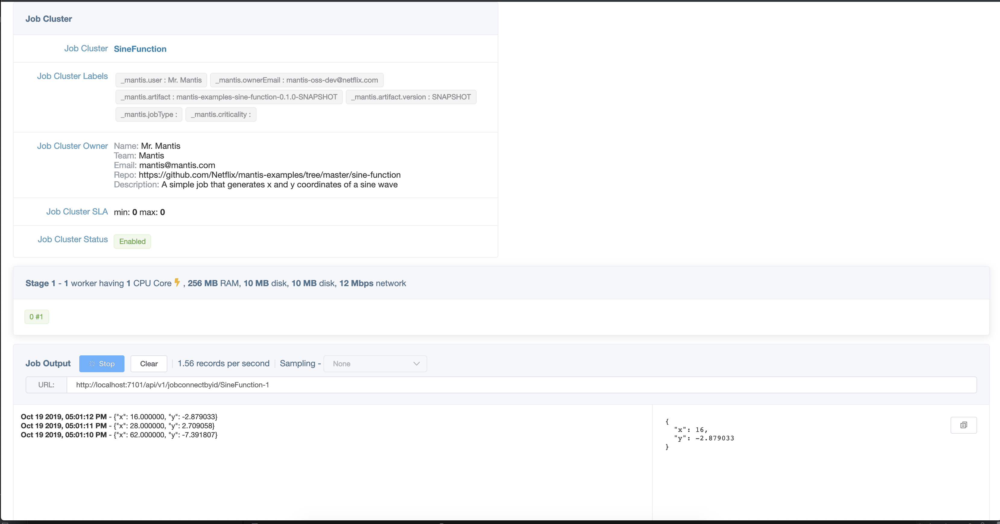
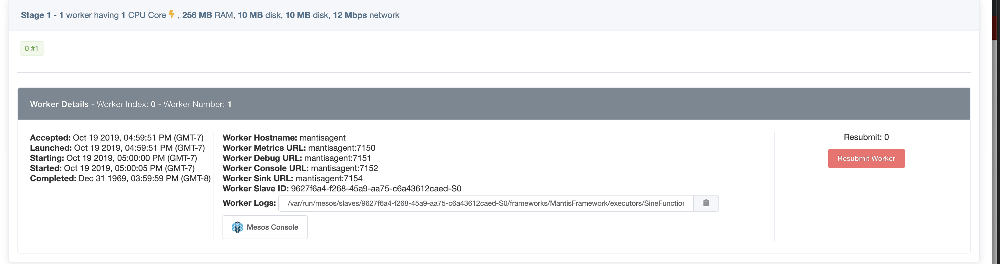

# Mantis Concepts

Mantis provides Stream-processing-As-a-Service. It is a self contained platform that manages all tasks associated
with running thousands of stream processing jobs. 

Take a look at [Infrastructure Overview](../internals/infrastructure-overview.md) to get an understanding of the physical components
of the Mantis Platform.
 
Let us walk through some of the key concepts and terminologies used in Mantis.

## Mantis Job Cluster


A Mantis Job cluster represents metadata (artifact, configuration, resource requirements) associated with a job.
A job can be thought of as a running instance of Job Cluster (like a Java Object is an instance of a Java class).
A Job cluster can have 0 or more running instances of a job at any given time. 
Users can control how many jobs can be running at any given time by specifying the SLA for this cluster. 

E.g.

SLA of Min 1 / Max 1 means there is exactly one instance of job running at any given time.
Users can also setup a Cron spec that can be used to submit jobs periodically.

## Mantis Jobs



At the core of Mantis is the Mantis Job.
Stream processing applications in Mantis are called Mantis Jobs. 
Logically a job represents the business logic to transform a stream of events from one or more sources and generate results.
A developer writes a job using Mantis primitives and builds an artifact which is then deployed into the Mantis platform for
execution. 
Each Mantis Job belongs to exactly one Mantis Job Cluster.

Lets take a closer look at a Mantis Job.

## Worker



A worker is the smallest unit of execution in Mantis. Physically a worker executes in a resource isolated
Mesos container on the Mantis Agent fleet of servers. 

Each worker is assigned a unique monotonically increasing `MantisWorkerIndex` and a unique `MantisWorkerNumber`
If a Mantis worker terminates abnormally, Mantis ensures a replacement worker gets launched with the same
`MantisWorkerIndex` and a new `MantisWorkerNumber`. 

The resources like CPU, Memory, Network allocated to a worker are configured at Job submit time and cannot
be updated later.

Each Worker belongs to exactly one Mantis Stage.

## Stages (Group of workers)

A Mantis job is logically divided into one or more [stages](../internals/mantis-jobs/processing-stage.md). A stage is a collection
of homogeneous Mantis Workers that perform the same computation. A typical map-reduce style
job would be represented by three stages in Mantis (shuffle, window/aggregate and collect)

Workers belonging to a stage establish network connections with all workers of the previous stage (if one exists)
Workers of the same stage do not connect to each other.

The presence of multiple stages imply network hops which allows users to distribute the job logic across several workers
allowing for more scalability.
 
Mantis allows each stage to dynamically scale the number of workers in the stage independently with the help of an
[autoscaling](../operate/autoscaling.md) policy.

!!! info
    Autoscaling is only recommended on stateless stages. For stateful stages the user would need to implement
    logic to move state to new workers. In cases where the state can be rebuilt rapidly this is not a concern.  

## Mantis Runtime

The [Mantis runtime](https://github.com/netflix/mantis) is execution environment for Mantis Jobs. 

Broadly speaking it covers all aspects of the running a Mantis Job which includes

- Operators based Reactive Extensions used by Jobs to implement their business logic. 
- Job topology management which builds and maintains the job execution DAG
- Exchanging control messages with the Mantis Master including heartbeats among other things. 

## Source Job

A source job is a type of Mantis Job that makes data available to other Mantis Jobs via an [MQL](../develop/querying/mql.md) interface.
Downstream jobs connect to the Sink (Server Sent Event) of the Source job with an MQL query which denotes what data the job is interested in.
Each event flowing through the Source job is evaluated against these MQL queries.
Events matching a particular query are then streamed to the corresponding downstream job.


The source jobs have several advantages

- **Pluggable source**: By abstracting out where the data is coming from, the source jobs allow the downstream jobs to
focus on just their processing logic. The same job can then work with data from different sources by simply connecting
to a different source jobs.
E.g There can be one source job (say A) backed by a Kafka topic and another backed by S3 (say B)
and the downstream job can either connect to A or B based on whether they want to process realtime data or historical data.

- **Data re-use**: Often a lot of jobs are interested in data from the same source. Just that they maybe interested
in different subsets of this data. Instead of each job having to re-fetch the same data again and again from the same external 
source, The source jobs fetch the data once and then make it available for any other job to use.

- **Cost Efficiency**: A direct consequence of data re-use is fewer resources are required. 

    E.g Let us assume there are 3 jobs interested in processing data from the same Kafka topic. But each is interested in different
    subsets of this data. Traditionally, each job would have to read the topic in its entirety and then filter out the 
    data they are not interested in. This means 3x fanout on Kafka, and additionally each job now has to have enough
    resources to process the entire topic. If this topic is high volume then these jobs would have to be sufficiently 
    scaled to keep up. All while throwing away large portions of the data.
    With a source job the Kafka fan out is just 1 and the three downstream jobs need to be scaled just enough to process
    their anticipated subset of the stream.

- **Less operational load**: Source jobs are stateless and thus good candidates for Autoscaling. With autoscaling
enabled the Mantis administrators do not have to worry about right sizing the resources, the job will just adapt its size
to meet the demands.

Mantis OSS comes with the following source jobs

1. [Kafka Source job](https://github.com/Netflix/mantis-source-jobs/tree/master/kafka-source-job): 
Reads data from one or more Kafka topics and makes it available for downstream consumers to query via MQL.

2. [Publish Source Job](https://github.com/Netflix/mantis-source-jobs/tree/master/publish-source-job):
Works the the mantis-publish library to fetch data on-demand from external applications and make it
available to downstream consumers. See the [On-Demand Sample](samples/on-demand.md) to see
this in action.

Users can also build their own source jobs see the [Synthetic Source Job](https://github.com/Netflix/mantis/tree/master/mantis-examples/mantis-examples-synthetic-sourcejob) example.

## Job Chaining

One of the unique capabilities of Mantis is the ability for Jobs to communicate with each other to form a kind of
streaming microservices architecture. The Source Job -> Downstream job flow is an example of this Job chaining. 
In this case the `source` of the downstream job is the output of the upstream Data source job. 
All a job needs to do to connect to the sink of another job is to include the in-built [Job Connnector](https://github.com/Netflix/mantis/blob/master/mantis-connectors/mantis-connector-job/src/main/java/io/mantisrx/connector/job/source/JobSource.java).

See the [Job Connector Sample](https://github.com/Netflix/mantis/tree/master/mantis-examples/mantis-examples-jobconnector-sample) to see this in action.

These job to job communications happen directly via in memory socket connections with no intermediate disk persistence.
If buffering/persistence of results is desired then it is recommended to sink the data into persistence queue like Kafka using
the [Kafka Connector](https://github.com/Netflix/mantis/blob/master/mantis-connectors/mantis-connector-kafka/src/main/java/io/mantisrx/connector/kafka/sink/KafkaSink.java)

Job chaining has proven to be extremely useful while operating at scale. It is widely used in the Netflix deployment of Mantis.
  
## Mantis Query Language (MQL)
 
[MQL](../develop/querying/mql.md) is a SQL like language that allows users to work with streaming data without having to write Java code.

Example MQL query:
```bash
select * from defaultStream where status==500
```    

MQL is used in various parts of Mantis platform including the mantis-publish library, Source Jobs and sometimes directly
as a library within a Job that can benefit from the query and aggregation features it brings.

## Mantis Master

The [Mantis Master](https://github.com/Netflix/mantis/tree/master/mantis-control-plane) is a leader elected control plane for the Mantis platform.
It is responsible for managing the life cycle of Job Clusters, Jobs and workers. It also acts as a Resource scheduler
to optimally allocate and schedule resources required by the Jobs. The master stores its meta-data into an external source.
The OSS version ships with a sample file based store. For production deployments a highly available store is recommended.

The Master is built using [Akka](https://akka.io/) principles, where each Job Cluster, Job etc are modelled as Actors.
For scheduling of resources Mantis relies on the Mesos Framework
The Master registers itself as a [Mesos Framework](https://mesos.apache.org/). It receives resource offers from Mesos
and uses [Fenzo](https://github.com/Netflix/Fenzo/) to optimally match workers to these offers. 

## Mantis API

The [Mantis API](../reference/api.md) is almost like a traditional API server which proxies request to the Mantis Master. 
But has additional capabilities such as:
 
- Allowing users to stream the output of a job via web sockets (`/api/v1/jobConnectbyid/jobID` API)
- Acts as a discovery server for Jobs, allowing consumers to get a stream of scheduling information (like host, port for
workers belonging to a job)
