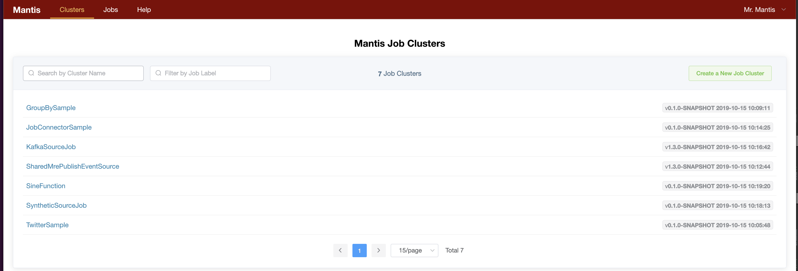

# Spinning up your first Mantis cluster using Docker

## Prerequisites

> Install Docker on your local machine (if you don't already have it)
>
1. [Mac](https://docs.docker.com/docker-for-mac/install/)
2. [Windows](https://docs.docker.com/docker-for-windows/install)
3. [Linux](https://docs.docker.com/install/linux/docker-ce/ubuntu/)

## Bootstraping your first Mantis Cluster in Docker
See [mantis-helm](https://github.com/Netflix/mantis-helm)

### Mantis Admin UI

The Mantis Admin UI allows you to manage your Mantis Jobs.

Open the [Mantis UI](https://netflix.github.io/mantis-ui/) in a new browser window.

Fill out the Registration form as follows


1. **Name:** `Example`
2. **Email:** `example@example.com`
3. **Master Name:** `Example`
4. **Mantis API URL:** `http://localhost:7101`
5. **Mesos URL:** `http://localhost:5050`

Click on `Create`

The Mantis Admin page should be pre-populated with all the Mantis examples.



### Try out Mantis Jobs

Now that you have setup a Mantis cluster locally try running some of the preconfigured
Mantis samples

1. [Sine Function Sample](../samples/sine-function.md) - A simple job that generates x and y
coordinates of a sine wave.

2. [Twitter Sample](../samples/twitter.md) - Connects to a twitter stream using consumer and token
keys specified and performs a streaming word count.

3. [On Demand Sample](../samples/on-demand.md) - Demonstrates
how Mantis Jobs can pull events on demand from external applications.


## Next steps

* [Setup Mantis in AWS](cloud.md) and run the samples

* Write your [first Mantis Job](../../develop/writing-jobs/word-count.md)

```
