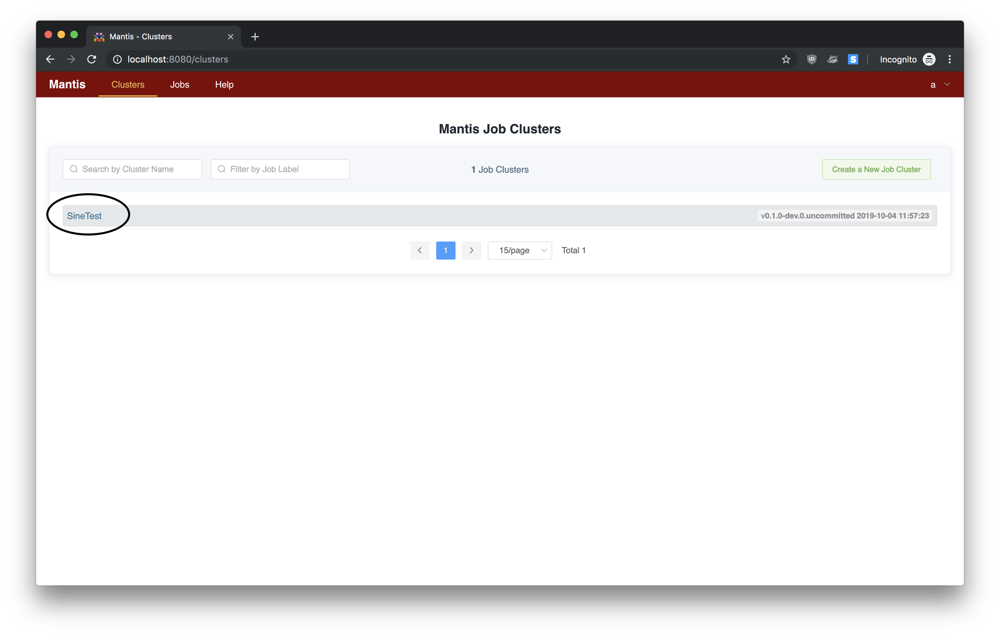

# Spinning up your first Mantis cluster in the cloud using the Mantis CLI

## Prerequisites

The Mantis CLI currently supports AWS by spinning up a minimal cluster using T2 micro
instances. This is meant for basic testing and not meant to run production traffic.

In order for you to spin up a cluster in AWS, you will need to create or use an
existing AWS account. You can follow AWS's [account creation instructions](https://aws.amazon.com/premiumsupport/knowledge-center/create-and-activate-aws-account/) for more information.

Once your account is created, you will need to create and download your AWS [Access Keys](https://docs.aws.amazon.com/general/latest/gr/aws-sec-cred-types.html#access-keys-and-secret-access-keys).
You can follow AWS's instructions on [creating access keys](https://docs.aws.amazon.com/IAM/latest/UserGuide/id_credentials_access-keys.html#Using_CreateAccessKey) for more information.

Now that you have your AWS account and access keys on hand, you're ready to bootstrap your first
Mantis cluster using the Mantis CLI.

## Bootstrapping your first Mantis cluster in AWS

### Download and install the Mantis CLI

First, you'll need to download the Mantis CLI app.

If you're on Mac OS, it's recommended that you download and install using the [Mac package](https://github.com/Netflix/mantis-cli/releases/download/v0.1.0/mantis-v0.1.0.pkg).

If you're on other systems such as Linux or Windows, choose the appropriate package from the latest release [Assets](https://github.com/Netflix/mantis-cli/releases).

### Configure AWS credentials

Now that you have the Mantis CLI installed, you'll need to tell it about your AWS credentials:

```sh
$ mantis aws:configure
AWS access key id: <input access key id>
AWS secret access key: <input secret access key>
Configuring AWS credentials... done
```

This command stores your AWS credentials in the same exact format and location as the AWS SDK.
More on this at the [Mantis CLI page](/cli#setting-up-your-aws-credentials).

### Bootstrap your cluster

With AWS credentials configured, you can bootstrap your cluster in a single command:

```sh
$ mantis aws:bootstrap
? select a region us-east-2
? Proceed with Mantis cluster creation? (Y/n) Y
  ↓ Create key pair [skipped]
    → Key-pair file already exists (mantis-us-east-2)
  ↓ Create default VPC [skipped]
    → Default VPC already exists
  ↓ Create zookeeper security group [skipped]
    → Security group already exists (zookeeper)
  ↓ Authorize zookeeper security group ssh port ingress [skipped]
    → Ingress rule already exists
  ↓ Authorize zookeeper security group zookeeper port ingress [skipped]
    → Ingress rule already exists
  ✔ Bootstrap Zookeeper node
  ↓ Create mesos-master security group [skipped]
    → Security group already exists (mesos-master)
  ↓ Authorize mesos-master security group ssh port ingress [skipped]
    → Ingress rule already exists
  ⠹ Authorize mesos-master security group mesos-master port 5050 ingress
    Bootstrap Mesos Master node
    Create mesos-slave security group
    Authorize mesos-slave security group ssh port ingress
    Authorize mesos-slave security group mantis-agent port 7104 ingress
    Authorize mesos-slave security group mantis-agent port 7150-7400 ingress
    Authorize mesos-slave security group mesos-slave resource port ingress
    Bootstrap Mesos Slave node
    Create mantis-control-plane security group
    Authorize mantis-control-plane security group ssh port ingress
    Authorize mantis-control-plane security group remote debug port 5050 ingress
    Authorize mantis-control-plane security group api port 8100 ingress
    Authorize mantis-control-plane security group api v2 port 8075 ingress
    Authorize mantis-control-plane security group scheduling info port 8076 ingress
    Authorize mantis-control-plane security group metrics port 8082 ingress
    Authorize mantis-control-plane security group console port 9090 ingress
    Bootstrap Mantis Control Plane service
    Create mantis-api security group
    Authorize mantis-api security group ssh port ingress
    Authorize mantis-api security group web port 80 ingress
    Authorize mantis-api security group ssl port 443 ingress
    Authorize mantis-api security group api port 7101 ingress
    Authorize mantis-api security group websocket port 7102 ingress
    Authorize mantis-api security group tunnel port 7001 ingress
  ✔ Bootstrap Mantis API service
Mantis API will be provisioned in a few minutes
	with public DNS available at <ec2 address>:7101
	Input this URL into your local Mantis UI to connect to the Mantis cluster.
Mesos Master will be provisioned in a few minutes
	with public DNS available at <ec2 address>:5050
	Input this URL into your local Mantis UI so it can connect to Mesos logs.
```

This will launch and configure 5 AWS EC2 instances. Notice at the end of the bootstrap
are 2 EC2 address. You will need these to input into the Mantis UI.

### Using the Mantis UI

Clone the Mantis UI project:

```bash
$ git clone https://github.com/Netflix/mantis-ui.git
```

Run the following commands (in the root directory of this project) to get all dependencies installed and to start the server:

```bash
$ yarn
$ yarn serve
```

Once the node server is up it should print something like:

```
 App running at:
 Local:   http://localhost:8080/
```

Point your browser to the above URL and fill out the Registration form as follows:


1. **Name:** `Example`
2. **Email:** `example@example.com`
3. **Master Name:** `Example`
4. **Mantis API URL:** `<your ec2 Mantis API URL outputted from the Mantis CLI>`
5. **Mesos URL:** `<your ec2 Mesos URL outputted from the Mantis CLI>`

### Launching a Mantis Job

When you go into the UI, you'll notice that the Mantis CLI has automatically preloaded a Job Cluster for you to try out.
Simply click on the `SineTest` Job Cluster to go into the cluster details page.



Once in the cluster details page, click on the green `Submit latest version` button on the top right to bring
you to the Job Submit page.


On the Job Submit page, everything has already been configured for you. All you have to do is hit the
green `Submit to Mantis` button at the bottom of the page to launch your first Mantis Job.


Now you can view the output of this job.

If all goes well your job would go into `Launched` state.


Scroll to the bottom and in the `Job Output` section click on `Start`

You should see output of the Sine function job being streamed below

```
Oct 4 2019, 03:55:39.338 PM - {"x": 26.000000, "y": 7.625585}
```

### Tearing down your cluster

Once you're done, you can clean up all of your AWS resources by tearing down instances and deleting security groups.

```sh
$ aws:teardown
? select a region us-east-2
? Proceed with Mantis cluster creation? (Y/n) Y
  ✔ Terminate instances
```

#### Debugging your cluster

You can debug your cluster by looking at the logs. To look at the logs, you'll need to go into your AWS EC2 Console
and find instances with the `Application: Mantis` tag.


From there, you can look at the instances with the following
security groups:

1. zookeeper
1. mesos-slave
1. mesos-master
1. mantis-control-plane
1. mantis-api

You can connect to your EC2 instances by following instructions from the `Connect` button at the top.

!!! note
    The Mantis CLI puts your EC2 `.pem` keys in the same folder as your AWS credentials, typically
    located in `$HOME/.aws`.

Application logs, e.g. Mantis-related or Zookeeper, for all instances will be located in `/logs`.

Mesos-related logs for `mesos-master` and `mesos-slave` will be located in `/var/run/mesos`.
