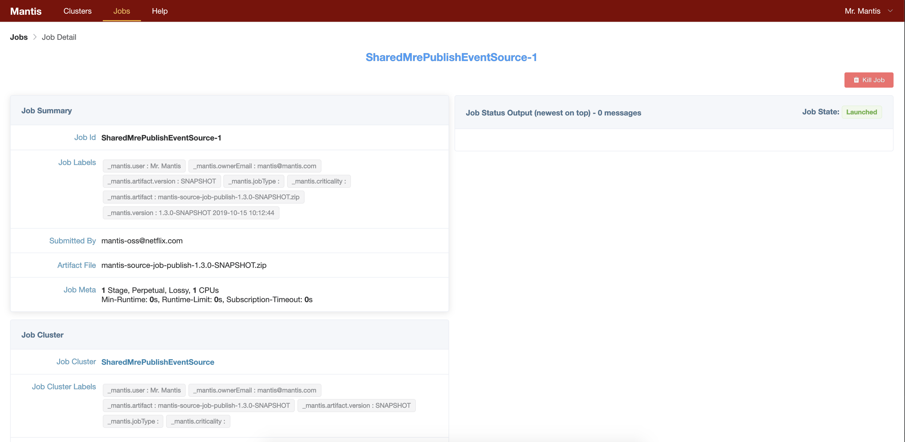
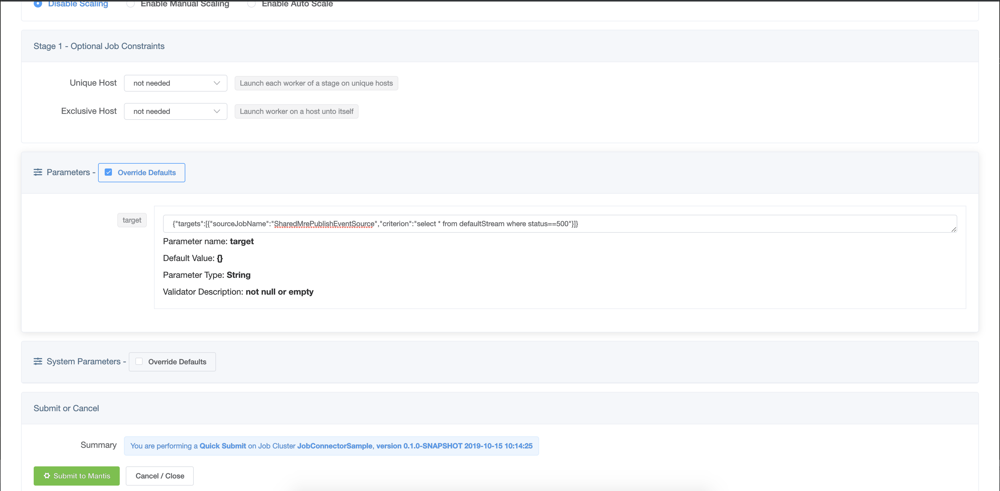
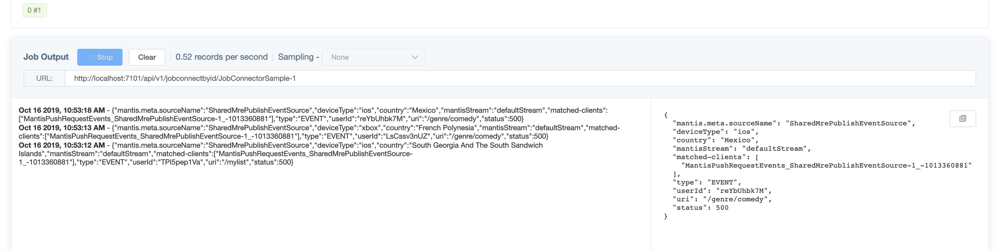

# Publishing Events to Mantis

One of the key features of Mantis is the ability to stream filtered events on-demand from external applications.

In this example we walk through publishing data to Mantis from a simple Java application using the mantis-publish library.
Followed by setting up a Data Source Job that will act as a broker 
and a simple Mantis Job that when launched will trigger on-demand streaming of data matching a certain
criterion.

This end-to-end example highlights two powerful Mantis concepts

1. On demand streaming of filtered data from external applications directly into Mantis

2. Job Chaining where one Job connects to the output of another job.

## Prerequisites

* `SharedMrePublishEventSource` Job Cluster exists.
* `JobConnectorSample` Job cluster exists

> **Note** If you are following the [Mantis Cluster using Docker](../docker.md) instructions this
>should be already setup. 


## Publishing data to Mantis

In a nutshell this involves adding a build dependency to the mantis-publish library, injecting
the Mantis Module and finally calling the publish API.

>  **Note**: The local docker setup has already preconfigured a simple [Java Sample](https://github.com/Netflix/mantis-examples/tree/master/mantis-publish-sample) application to publish events
to Mantis. So you can **skip** this section if you are not instrumenting your own application.

### Adding build dependency

```bash
compile 'io.mantisrx:mantis-publish-netty-guice:1.2.+'

```

### Inject the MantisRealtimeEventsPublishModule

In addition to injecting `MantisRealtimeEventsPublishModule` you will also need to add the 
`ArchaiusModule` and the `SpectatorModule` if not already injected.
```java
Injector injector = Guice.createInjector(new BasicModule(), new ArchaiusModule(),
                new MantisRealtimeEventsPublishModule(), new SpectatorModule());
```

### Publish events to Mantis

First you would need to inject the `EventPublisher`
```java
@Inject
    EventPublisher publisher;
```

Publishing events to Mantis. The publish API requires an [Event](https://github.com/Netflix/mantis-publish/blob/master/mantis-publish-core/src/main/java/io/mantisrx/publish/api/Event.java) object
You can construct one by passing in a `Map<String,Object>` to its constructor or used the default constructor
and set individual fields.
 
```java

publisher.publish(event);
```

### Configuring where to send data

We need to configure the location of the Mantis API server for the mantis-publish library to bootstrap

Add the following properties to your `application.properties`

```bash
mantis.publish.discovery.api.hostname=<IP of Mantis API>

# mantis api port
mantis.publish.discovery.api.port=<port for Mantis API>

# This application's name
mantis.publish.app.name=JavaApp
``` 
## Setting up a Publish Data Source Job

A Publish Source Job is a special kind of a Mantis Job that interacts with the mantis-publish library
on behalf of a downstream job to push `subscriptions` up to the mantis-publish library and receive events 
matching the subscription from the mantis-publish library.

### Submit the SharedMrePublishEventSource

Part of the docker setup we have preconfigured the `SharedMrePublishEventSource` cluster. So all we have 
to do is submit an instance of it.

1. Go to the [clusters page](https://netflix.github.io/mantis-ui/#/clusters) and click on `SharedMrePublishEventSource`

2. Click `submit` on the top right corner of the screen

    

3. This will open up the Job Detail page. Now wait for the Job to go into `Launched` state

    

You are all set. Now the Java application referenced in the previous section should be able to
communicate with this source job to exchange subscriptions and data.

At this point however there are no active subscriptions so no data is actually being sent out from our
Java application. If you look at the shell window where the docker is running you should see output like

```bash
mantispublish_1     | 2019-10-16 17:55:46 INFO  SampleDataPublisher:56 - Mantis publish JavaApp send event status => SKIPPED_NO_SUBSCRIPTIONS(PRECONDITION_FAILED)
```

Next step. Launch a new job to query for Data generated by the Java application.

## Query data generated by the Java application.

Our Java application generates a stream of Events representing requests made to it by an external client.
Say we want to look at all events that are failing i.e have `status=500`

### Submit a query job
Now we launch a simple Mantis Job to query data generated by our Java Application.

1. Go to [clusters page](https://netflix.github.io/mantis-ui/#/clusters) and click on `JobConnectorSample`

2. Click the green `submit` button on the top right corner of the screen.
    
3. On the Job submit page scroll down and click on `Override Defaults` to configure our query.

   Enter the following as the value for parameter `target`
   
   ```json
    {"targets":[{"sourceJobName":"SharedMrePublishEventSource","criterion":"select * from defaultStream where status==500"}]}
   ```
 
   and hit submit. 
    
      
  
   Two key things to note:
   
   * We set the `sourceJobName` to `SharedMrePublishEventSource` which is the source job we configured in the
   previous step.
   * We set the `criterion` key in the payload to our MQL query `select * from defaultStream where status==500`
   
   Click on Submit.
   
On the Job Detail page scroll down to the `Job Output` section and click on Start.
   In a few seconds you should see events matching our query flow through.
   
    
   
If you go back to the shell that is running the docker images you should now see output like

```bash
mantispublish_1     | 2019-10-16 17:58:32 INFO  SampleDataPublisher:56 - Mantis publish JavaApp send event status => ENQUEUED(SENDING)
```   
If we now terminate our `JobConnector` Job, then our Java application will again revert to not sending
any data.
           
## Take aways

By integrating the mantis-publish library with their applications, users can get access to rich data generated
by their applications in realtime and in a cost-effective manner for analysis into their jobs. 


 