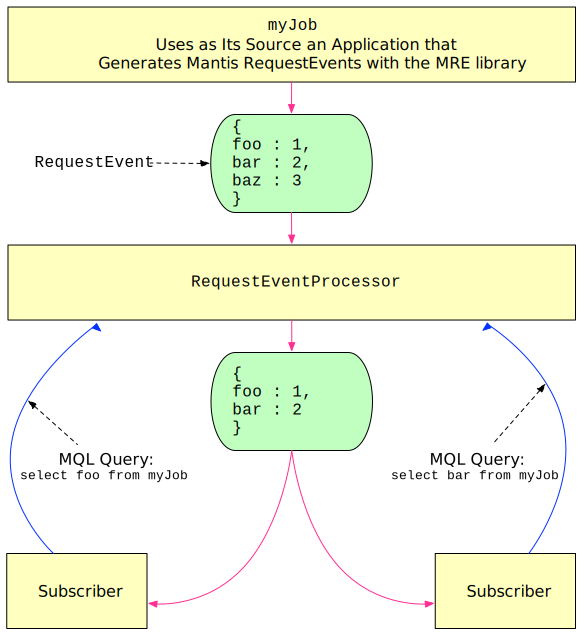

The Mantis Publish library (known internally to Netflix as Mantis Realtime Events, or MRE) allows your application to stream events into Mantis.
The library supports JVM and Node.js applications.

Mantis Publish takes care of filtering the events you send into Mantis, and it will only transmit them over the
network if a Mantis client that is interested in such events is currently subscribed.

Mantis Publish contains a subscription registry where each client subscription is represented by its
corresponding [Mantis Query Language] (MQL) query. Mantis Publish evaluates all MQL queries from its
subscription registry against each event as the event is generated by your application. It then tags
events with all of the matching MQL queries and enriches the event with a superset of fields from
the matched queries. That is, rather than emitting *n* events for *n* matching MQL queries, Mantis Publish will
instead emit a single event containing all of the fields requested by the matched queries. This
happens directly within your application before any events are sent over the network into Mantis.
Further, Mantis Publish only dispatches events if a client is subscribed with a matching query. This means that
you can freely produce events without incurring the cost until an active subscription exists.

## How to Add the Mantis Publish Library

To add this library to your application, include [mantis-publish-netty](https://search.maven.org/search?q=a:mantis-publish-netty)
in your application’s dependencies.

## How to Stream Events Into Mantis

If your application wants to stream events into Mantis, you can use the Mantis Publish library directly by
instantiating a `MantisEventPublisher` in your application code. In order to create a `MantisEventPublisher`,
you will have to inject a few parameters. An example of which parameters are required and how to inject them
can be found in [here](https://github.com/Netflix/mantis-publish/blob/master/mantis-publish-netty/src/test/java/io/mantisrx/publish/netty/LocalMrePublishClientInitializer.java).

Once injected, either manually via constructor or an injection framework such as Guice or Spring,
you must use the `MrePublishClientInitializer` class and call `MrePublishClientInitializer#start` to start all
the underlying components. From there, you can get an event publisher by calling `MrePublishClientInitializer#getEventPublisher`.
An example of this can be found [here](https://github.com/Netflix/mantis-publish/blob/master/mantis-publish-netty/src/test/java/io/mantisrx/publish/netty/LocalMrePublishClientInitializer.java#L123-L133).

Then, for each event your application generates, create a `Event` object with your desired event fields,
and pass that `Event` to the `MantisEventPublisher#publish` method. For example:

```java hl_lines="9 18"
// Create an `Event` for Mantis Publish using your application event.
final Event event = new Event();
event.set("testKey", "testValue");

// Send your `Event` into Mantis.
// Note: This event will only be dispatched over the network
// if a subscription with a matching MQL query exists.
eventPublisher.publish(event);
```

## The Runtime Flow of Mantis Publish

Mantis Publish runtime flow consists of three phases: connecting, event processing, and event delivery.

### Phase 1: Connecting

Mantis Publish will only stream an event from your application into Mantis if there is a subscriber to that
specific application instance with an MQL query that matches the event. Any [Mantis Job] can connect
to these applications. However, it is a best practice to have [Source Jobs] connect to Mantis Publish
applications. This is because Source Jobs provide several conveniences over regular Mantis Jobs,
such as multiplexing events and connection management. By leveraging Source Jobs as an intermediary,
Mantis Jobs are able to consume events from an external source without having to worry about
lower-level details of that external source.

This is possible through job chaining, which Mantis provides by default. When connecting to a
Mantis Publish application, downstream Mantis Jobs will send subscription requests with an MQL query via HTTP to a Source
Job. The Source Job will store these subscriptions in memory. These subscriptions are then fetched by upstream
applications at the edge running the Mantis Publish library. Once the upstream edge Mantis Publish application
is aware of the subscription, it will start pushing events downstream into the Source Job.

!!! note
    The Mantis Publish library not only handles subscriptions, but also takes care of discovering Source Job workers
    so you do not have to worry about Source Job rebalancing/autoscaling.
    For more information about Source Jobs see
    [Mantis Internals: Mantis Source Jobs](../internals/sourcejobs).

#### Creating Stream Subscriptions

Clients such as Mantis Jobs connect to a Mantis Publish application by submitting a subscription represented
by an HTTP request. Mantis Publish’s `StreamManager` maintains these subscriptions in-memory. The
`StreamManager` manages internal resources such as subscriptions, streams, and internal processing
queues.

Clients can create subscriptions to different event streams. There are two types:

1. **`default` streams** contain events emitted by applications that use the Mantis Publish library.
1. **`log` streams** contain events which may not be core to the application, such as log or general infrastructure events.

### Phase 2: Event Processing

Event processing within Mantis Publish takes place in two steps: event ingestion and event dispatch.

#### Event Ingestion

Event ingestion begins at the edge, in your application, by invoking `EventPublisher#publish` which places the
event onto an internal queue for dispatching.

#### Event Dispatch

Events are dispatched by a drainer thread created by the Event Publisher. The drainer will drain events
from the internal queue previously populated by `EventPublisher#publish`, perform some transformations,
and finally dispatch events over the network and into Mantis.

Events are transformed by an `EventProcessor` which processes events one at a time.
Transformation includes the following steps:

1. Masks sensitive fields in the event.
    - Sensitive fields are referenced by a blacklist defined by a configuration
      (`mantis.publish.blacklist`).
    - This blacklist is a comma-delimited string of keys you wish to blacklist in your event. The
      `param.password` key is included by default.
1. Evaluates the MQL query of each subscription and builds a list of matching subscriptions.
1. For each matching subscription, enriches the event with a superset of fields from the MQL query
   from all the other matching subscriptions (see the following diagram).
1. Sends this enriched event to all of the subscribers (see
   [Event Delivery](#phase-3-event-delivery) below for the details).

!!! note
    More Mantis Publish configuration options can be found [here](https://github.com/Netflix/mantis-publish/blob/d69d549335cd74149395e9a48780dd702bbc1b82/mantis-publish-core/src/main/java/io/mantisrx/publish/config/MrePublishConfiguration.java).



### Phase 3: Event Delivery

Mantis Publish delivers events on-demand. When a client subscribes to a Mantis Job that issues an MQL query,
the Event Publisher delivers the event using non-blocking I/O.

<!-- Do not edit below this line -->
<!-- START -->
<!-- This section comes from the file "reference_links". It is automagically inserted into other files by means of the "refgen" script, also in the "docs/" directory. Edit this section only in the "reference_links" file, not in any of the other files in which it is included, or your edits will be overwritten. -->
[artifact]:                ../../glossary#artifact          "Each Mantis Job has an associated artifact file that contains its source code and JSON configuration."
[artifacts]:               ../../glossary#artifact          "Each Mantis Job has an associated artifact file that contains its source code and JSON configuration."
[artifact file]:           ../../glossary#artifact          "Each Mantis Job has an associated artifact file that contains its source code and JSON configuration."
[artifact files]:          ../../glossary#artifact          "Each Mantis Job has an associated artifact file that contains its source code and JSON configuration."
[autoscale]:               ../../glossary#autoscaling       "You can establish an autoscaling policy for each component of your Mantis Job that governs how Mantis adjusts the number of workers assigned to that component as its workload changes."
[autoscaled]:              ../../glossary#autoscaling       "You can establish an autoscaling policy for each component of your Mantis Job that governs how Mantis adjusts the number of workers assigned to that component as its workload changes."
[autoscales]:              ../../glossary#autoscaling       "You can establish an autoscaling policy for each component of your Mantis Job that governs how Mantis adjusts the number of workers assigned to that component as its workload changes."
[autoscaling]:             ../../glossary#autoscaling       "You can establish an autoscaling policy for each component of your Mantis Job that governs how Mantis adjusts the number of workers assigned to that component as its workload changes."
[scalable]:                ../../glossary#autoscaling       "You can establish an autoscaling policy for each component of your Mantis Job that governs how Mantis adjusts the number of workers assigned to that component as its workload changes."
[AWS]:                     javascript:void(0)          "Amazon Web Services"
[backpressure]:            ../../glossary#backpressure      "Backpressure refers to a set of possible strategies for coping with ReactiveX Observables that produce items more rapidly than their observers consume them."
[Binary compression]:      ../../glossary#binarycompression
[broadcast]:               ../../glossary#broadcast         "In broadcast mode, each worker of your job gets all the data from all workers of the Source Job rather than having that data distributed equally among the workers of your job."
[broadcast mode]:          ../../glossary#broadcast         "In broadcast mode, each worker of your job gets all the data from all workers of the Source Job rather than having that data distributed equally among the workers of your job."
[Cassandra]:               ../../glossary#cassandra         "Apache Cassandra is an open source, distributed database management system."
[cluster]:                 ../../glossary#cluster           "A Mantis Job Cluster is a containing entity for Mantis Jobs. It defines metadata and certain service-level agreements. Job Clusters ease job lifecycle management and job revisioning."
[clusters]:                ../../glossary#cluster           "A Mantis Job Cluster is a containing entity for Mantis Jobs. It defines metadata and certain service-level agreements. Job Clusters ease job lifecycle management and job revisioning."
[cold]:                    ../../glossary#cold              "A cold ReactiveX Observable waits until an observer subscribes to it before it begins to emit items. This means the observer is guaranteed to see the whole Observable sequence from the beginning. This is in contrast to a hot Observable, which may begin emitting items as soon as it is created, even before observers have subscribed to it."
[cold Observable]:         ../../glossary#cold              "A cold ReactiveX Observable waits until an observer subscribes to it before it begins to emit items. This means the observer is guaranteed to see the whole Observable sequence from the beginning. This is in contrast to a hot Observable, which may begin emitting items as soon as it is created, even before observers have subscribed to it."
[cold Observables]:        ../../glossary#cold              "A cold ReactiveX Observable waits until an observer subscribes to it before it begins to emit items. This means the observer is guaranteed to see the whole Observable sequence from the beginning. This is in contrast to a hot Observable, which may begin emitting items as soon as it is created, even before observers have subscribed to it."
[component]:               ../../glossary#component         "A Mantis Job is composed of three types of component: a Source, one or more Processing Stages, and a Sink."
[components]:              ../../glossary#component         "A Mantis Job is composed of three types of component: a Source, one or more Processing Stages, and a Sink."
[custom source]:           ../../glossary#customsource      "In contrast to a Source Job, which is a built-in variety of Source component designed to pull data from a common sort of data source, a custom source typically accesses data from less-common sources or has unusual delivery guarantee semantics."
[custom sources]:          ../../glossary#customsource      "In contrast to a Source Job, which is a built-in variety of Source component designed to pull data from a common sort of data source, a custom source typically accesses data from less-common sources or has unusual delivery guarantee semantics."
[executor]:                ../../glossary#executor          "The stage executor is responsible for loading the bytecode for a Mantis Job and then executing its stages and workers in a coordinated fashion. In the Mesos UI, workers are also referred to as executors."
[executors]:               ../../glossary#executor          "The stage executor is responsible for loading the bytecode for a Mantis Job and then executing its stages and workers in a coordinated fashion. In the Mesos UI, workers are also referred to as executors."
[fast property]: ../../glossary#fastproperties "Fast properties allow you to change the behavior of Netflix services without recompiling and redeploying them."
[fast properties]: ../../glossary#fastproperties "Fast properties allow you to change the behavior of Netflix services without recompiling and redeploying them."
[Fenzo]:                   ../../glossary#fenzo             "Fenzo is a Java library that implements a generic task scheduler for Mesos frameworks."
[grouped]:                 ../../glossary#grouped           "Grouped data is distinguished from scalar data in that each datum is accompanied by a key that indicates what group it belongs to. Grouped data can be processed by a RxJava GroupedObservable or by a MantisGroup."
[grouped data]:            ../../glossary#grouped           "Grouped data is distinguished from scalar data in that each datum is accompanied by a key that indicates what group it belongs to. Grouped data can be processed by a RxJava GroupedObservable or by a MantisGroup."
[GRPC]:                    ../../glossary#grpc              "gRPC is an open-source RPC framework using Protocol Buffers."
[hot]:                     ../../glossary#hot               "A hot ReactiveX Observable may begin emitting items as soon as it is created, even before observers have subscribed to it. This means the observer may miss items that were emitted before the observer subscribed. This is in contrast to a cold Observable, which waits until an observer subscribes to it before it begins to emit items."
[hot Observable]:          ../../glossary#hot               "A hot ReactiveX Observable may begin emitting items as soon as it is created, even before observers have subscribed to it. This means the observer may miss items that were emitted before the observer subscribed. This is in contrast to a cold Observable, which waits until an observer subscribes to it before it begins to emit items."
[hot Observables]:         ../../glossary#hot               "A hot ReactiveX Observable may begin emitting items as soon as it is created, even before observers have subscribed to it. This means the observer may miss items that were emitted before the observer subscribed. This is in contrast to a cold Observable, which waits until an observer subscribes to it before it begins to emit items."
[JMC]:                     ../../glossary#jmc               "Java Mission Control is a tool from Oracle with which developers can monitor and manage Java applications."
[job]:                     ../../glossary#job               "A Mantis Job takes in a stream of data, transforms it by using RxJava operators, and then outputs the results as another stream. It is composed of a Source, one or more Processing Stages, and a Sink."
[jobs]:                    ../../glossary#job               "A Mantis Job takes in a stream of data, transforms it by using RxJava operators, and then outputs the results as another stream. It is composed of a Source, one or more Processing Stages, and a Sink."
[Mantis job]:              ../../glossary#job               "A Mantis Job takes in a stream of data, transforms it by using RxJava operators, and then outputs the results as another stream. It is composed of a Source, one or more Processing Stages, and a Sink."
[Mantis jobs]:             ../../glossary#job               "A Mantis Job takes in a stream of data, transforms it by using RxJava operators, and then outputs the results as another stream. It is composed of a Source, one or more Processing Stages, and a Sink."
[job cluster]:             ../../glossary#jobcluster        "A Mantis Job Cluster is a containing entity for Mantis Jobs. It defines metadata and certain service-level agreements. Job Clusters ease job lifecycle management and job revisioning."
[job clusters]:            ../../glossary#jobcluster        "A Mantis Job Cluster is a containing entity for Mantis Jobs. It defines metadata and certain service-level agreements. Job Clusters ease job lifecycle management and job revisioning."
[Job Master]:              ../../glossary#jobmaster         "If a job is configured with autoscaling, Mantis will add a Job Master component to it as its initial component. This component will send metrics back to Mantis to help it govern the autoscaling process."
[Mantis Master]:           ../../glossary#mantismaster      "The Mantis Master coordinates the execution of [Mantis Jobs] and starts the services on each Worker."
[Kafka]:                   ../../glossary#kafka             "Apache Kafka is a large-scale, distributed streaming platform."
[keyed data]:              ../../glossary#keyed             "Grouped (or keyed) data is distinguished from scalar data in that each datum is accompanied by a key that indicates what group it belongs to. Grouped data can be processed by a RxJava GroupedObservable or by a MantisGroup."
[Keystone]:                ../../glossary#keystone          "Keystone is Netflix’s data backbone, a stream processing platform that focuses on data analytics."
[label]:                   ../../glossary#label             "A label is a text key/value pair that you can add to a Job Cluster or to an individual Job to make it easier to search for or group."
[labels]:                  ../../glossary#label             "A label is a text key/value pair that you can add to a Job Cluster or to an individual Job to make it easier to search for or group."
[Log4j]:                   ../../glossary#log4j             "Log4j is a Java-based logging framework."
[Apache Mesos]:            ../../glossary#mesos             "Apache Mesos is an open-source technique for balancing resources across frameworks in clusters."
[Mesos]:                   ../../glossary#mesos             "Apache Mesos is an open-source technique for balancing resources across frameworks in clusters."
[metadata]:                ../../glossary#metadata          "Mantis inserts metadata into its Job payload. This may include information about where the data came from, for instance. You can define additional metadata to include in the payload when you establish the Job Cluster."
[meta message]:            ../../glossary#metamessage       "A Source Job may occasionally inject meta messages into its data stream that indicate things like data drops."
[meta messages]:           ../../glossary#metamessage       "A Source Job may occasionally inject meta messages into its data stream that indicate things like data drops."
[migration strategy]:      ../../glossary#migration
[migration strategies]:    ../../glossary#migration
[MRE]:                     ../../glossary#mre               "Mantis Publish (a.k.a. Mantis Realtime Events, or MRE) is a library that your application can use to stream events into Mantis while respecting MQL filters."
[Mantis Publish]:          ../../glossary#mantispublish     "Mantis Publish is a library that your application can use to stream events into Mantis while respecting MQL filters."
[Mantis Query Language]:   ../../glossary#mql               "You use Mantis Query Language to define filters and other data processing that Mantis applies to a Source data stream at its point of origin, so as to reduce the amount of data going over the wire."
[MQL]:                     ../../glossary#mql               "You use Mantis Query Language to define filters and other data processing that Mantis applies to a Source data stream at its point of origin, so as to reduce the amount of data going over the wire."
[Observable]:              ../../glossary#observable        "In ReactiveX an Observable is the method of processing a stream of data in a way that facilitates its transformation and consumption by observers. Observables come in hot and cold varieties. There is also a GroupedObservable that is specialized to grouped data."
[Observables]:             ../../glossary#observable        "In ReactiveX an Observable is the method of processing a stream of data in a way that facilitates its transformation and consumption by observers. Observables come in hot and cold varieties. There is also a GroupedObservable that is specialized to grouped data."
[parameter]:               ../../glossary#parameter         "A Mantis Job may accept parameters that modify its behavior. You can define these in your Job Cluster definition, and set their values on a per-Job basis."
[parameters]:              ../../glossary#parameter         "A Mantis Job may accept parameters that modify its behavior. You can define these in your Job Cluster definition, and set their values on a per-Job basis."
[Processing Stage]:        ../../glossary#stage             "A Processing Stage component of a Mantis Job transforms the RxJava Observables it obtains from the Source component."
[Processing Stages]:       ../../glossary#stage             "A Processing Stage component of a Mantis Job transforms the RxJava Observables it obtains from the Source component."
[stage]:                   ../../glossary#stage             "A Processing Stage component of a Mantis Job transforms the RxJava Observables it obtains from the Source component."
[stages]:                  ../../glossary#stage             "A Processing Stage component of a Mantis Job transforms the RxJava Observables it obtains from the Source component."
[property]:                ../../glossary#property          "A property is a particular named data value found within events in an event stream."
[properties]:              ../../glossary#property          "A property is a particular named data value found within events in an event stream."
[Reactive Stream]:         ../../glossary#reactivestreams   "Reactive Streams is the latest advance of the ReactiveX project. It is an API for manipulating streams of asynchronous data in a non-blocking fashion, with backpressure."
[Reactive Streams]:        ../../glossary#reactivestreams   "Reactive Streams is the latest advance of the ReactiveX project. It is an API for manipulating streams of asynchronous data in a non-blocking fashion, with backpressure."
[ReactiveX]:               ../../glossary#reactivex         "ReactiveX is a software technique for transforming, combining, reacting to, and managing streams of data. RxJava is an example of a library that implements this technique."
[RxJava]:                  ../../glossary#rxjava            "RxJava is the Java implementation of ReactiveX, a software technique for transforming, combining, reacting to, and managing streams of data."
[downsample]:              ../../glossary#sampling          "Sampling is an MQL strategy for mitigating data volume issues. There are two sampling strategies: Random and Sticky. Random sampling uniformly downsamples the source stream to a percentage of its original volume. Sticky sampling selectively samples data from the source stream based on key values."
[sample]:                  ../../glossary#sampling          "Sampling is an MQL strategy for mitigating data volume issues. There are two sampling strategies: Random and Sticky. Random sampling uniformly downsamples the source stream to a percentage of its original volume. Sticky sampling selectively samples data from the source stream based on key values."
[sampled]:                 ../../glossary#sampling          "Sampling is an MQL strategy for mitigating data volume issues. There are two sampling strategies: Random and Sticky. Random sampling uniformly downsamples the source stream to a percentage of its original volume. Sticky sampling selectively samples data from the source stream based on key values."
[samples]:                 ../../glossary#sampling          "Sampling is an MQL strategy for mitigating data volume issues. There are two sampling strategies: Random and Sticky. Random sampling uniformly downsamples the source stream to a percentage of its original volume. Sticky sampling selectively samples data from the source stream based on key values."
[sampling]:                ../../glossary#sampling          "Sampling is an MQL strategy for mitigating data volume issues. There are two sampling strategies: Random and Sticky. Random sampling uniformly downsamples the source stream to a percentage of its original volume. Sticky sampling selectively samples data from the source stream based on key values."
[scalar]:                  ../../glossary#scalar            "Scalar data is distinguished from keyed or grouped data in that it is not categorized into groups by key. Scalar data can be processed by an ordinary ReactiveX Observable."
[scalar data]:             ../../glossary#scalar            "Scalar data is distinguished from keyed or grouped data in that it is not categorized into groups by key. Scalar data can be processed by an ordinary ReactiveX Observable."
[Sink]:                    ../../glossary#sink              "The Sink is the final component of a Mantis Job. It takes the Observable that has been transformed by the Processing Stage and outputs it in the form of a new data stream."
[Sinks]:                   ../../glossary#sink              "The Sink is the final component of a Mantis Job. It takes the Observable that has been transformed by the Processing Stage and outputs it in the form of a new data stream."
[Sink component]:          ../../glossary#sink              "The Sink is the final component of a Mantis Job. It takes the Observable that has been transformed by the Processing Stage and outputs it in the form of a new data stream."
[service-level agreement]:  ../../glossary#sla               "A service-level agreement, in the Mantis context, is defined on a per-Cluster basis. You use it to configure how many Jobs in the cluster will be in operation at any time, among other things."
[service-level agreements]: ../../glossary#sla               "A service-level agreement, in the Mantis context, is defined on a per-Cluster basis. You use it to configure how many Jobs in the cluster will be in operation at any time, among other things."
[SLA]:                     ../../glossary#sla               "A service-level agreement, in the Mantis context, is defined on a per-Cluster basis. You use it to configure how many Jobs in the cluster will be in operation at any time, among other things."
[Source]:                  ../../glossary#source            "The Source component of a Mantis Job fetches data from a source outside of Mantis and makes it available to the Processing Stage component in the form of an RxJava Observable. There are two varieties of Source: a Source Job and a custom source."
[Sources]:                 ../../glossary#source            "The Source component of a Mantis Job fetches data from a source outside of Mantis and makes it available to the Processing Stage component in the form of an RxJava Observable. There are two varieties of Source: a Source Job and a custom source."
[Source Job]:              ../../glossary#sourcejob         "A Source Job is a Mantis Job that you can use as a Source, which wraps a data source external to Mantis and makes it easier for you to create a job that observes its data."
[Source Jobs]:             ../../glossary#sourcejob         "A Source Job is a Mantis Job that you can use as a Source, which wraps a data source external to Mantis and makes it easier for you to create a job that observes its data."
[Spinnaker]: ../../glossary#spinnaker "Spinnaker is a set of resources that help you deploy and manage resources in the cloud."
[SSE]:                     ../../glossary#sse               "Server-sent events (SSE) are a way for a browser to receive automatic updates from a server through an HTTP connection. Mantis includes an SSE Sink."
[server-sent event]:       ../../glossary#sse               "Server-sent events (SSE) are a way for a browser to receive automatic updates from a server through an HTTP connection. Mantis includes an SSE Sink."
[server-sent events]:      ../../glossary#sse               "Server-sent events (SSE) are a way for a browser to receive automatic updates from a server through an HTTP connection. Mantis includes an SSE Sink."
[transform]:               ../../glossary#transformation    "A transformation acts on each datum from a stream or Observables of data, changing it in some manner before passing it along as a new stream or Observable. Transformations may change data between scalar and grouped forms."
[transformed]:             ../../glossary#transformation    "A transformation acts on each datum from a stream or Observables of data, changing it in some manner before passing it along as a new stream or Observable. Transformations may change data between scalar and grouped forms."
[transforms]:              ../../glossary#transformation    "A transformation acts on each datum from a stream or Observables of data, changing it in some manner before passing it along as a new stream or Observable. Transformations may change data between scalar and grouped forms."
[transformation]:          ../../glossary#transformation    "A transformation acts on each datum from a stream or Observables of data, changing it in some manner before passing it along as a new stream or Observable. Transformations may change data between scalar and grouped forms."
[transformations]:         ../../glossary#transformation    "A transformation acts on each datum from a stream or Observables of data, changing it in some manner before passing it along as a new stream or Observable. Transformations may change data between scalar and grouped forms."
[transient]:               ../../glossary#transient         "A transient (or ephemeral) Mantis Job is automatically killed by Mantis after a certain amount of time has passed since the last subscriber to the job disconnects."
[transient job]:           ../../glossary#transient         "A transient (or ephemeral) Mantis Job is automatically killed by Mantis after a certain amount of time has passed since the last subscriber to the job disconnects."
[transient jobs]:          ../../glossary#transient         "A transient (or ephemeral) Mantis Job is automatically killed by Mantis after a certain amount of time has passed since the last subscriber to the job disconnects."
[WebSocket]:               ../../glossary#websocket         "WebSocket is a two-way, interactive communication channel that works over HTTP. In the Mantis context, it is an alternative to SSE."
[Worker]:                  ../../glossary#worker            "A worker is the smallest unit of work that is scheduled within a Mantis component. You can configure how many resources Mantis allocates to each worker, and Mantis will adjust the number of workers your Mantis component needs based on its autoscaling policy."
[Workers]:                 ../../glossary#worker            "A worker is the smallest unit of work that is scheduled within a Mantis component. You can configure how many resources Mantis allocates to each worker, and Mantis will adjust the number of workers your Mantis component needs based on its autoscaling policy."
[Zookeeper]:               ../../glossary#zookeeper         "Apache Zookeeper is an open-source server that maintains configuration information and other services required by distributed applications."
<!-- END -->
