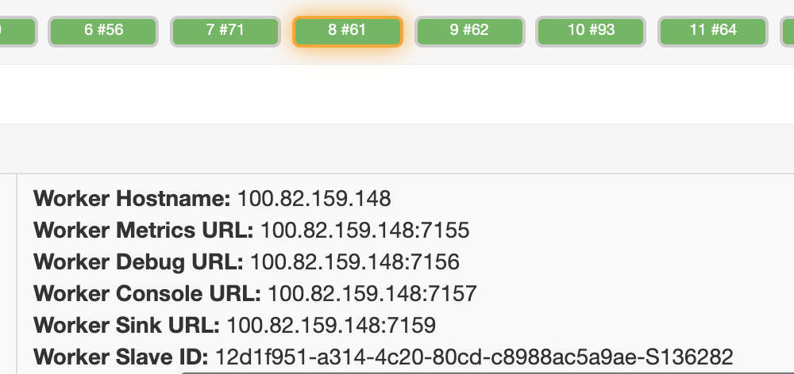
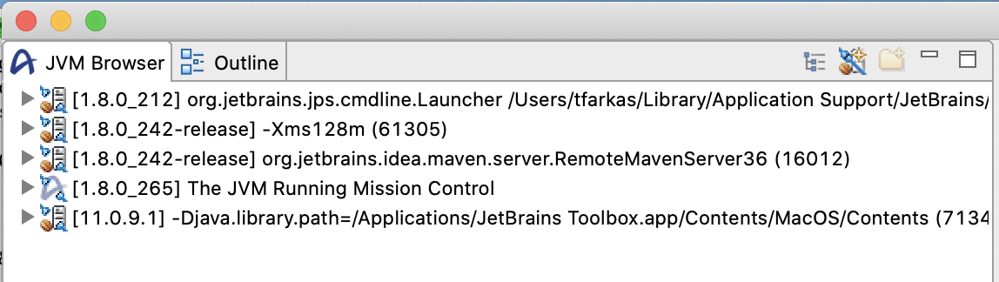
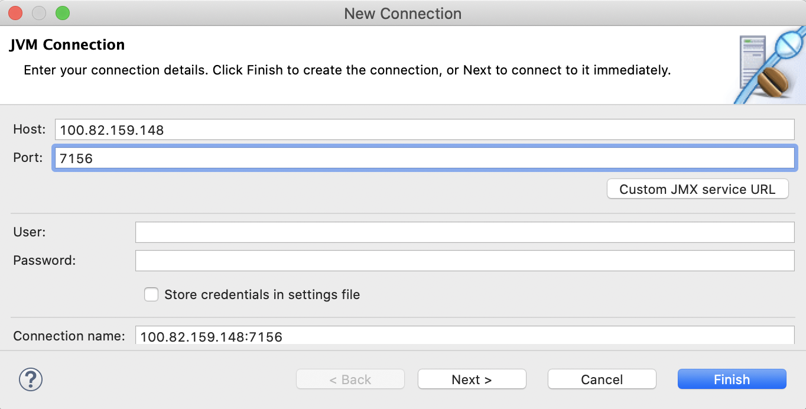
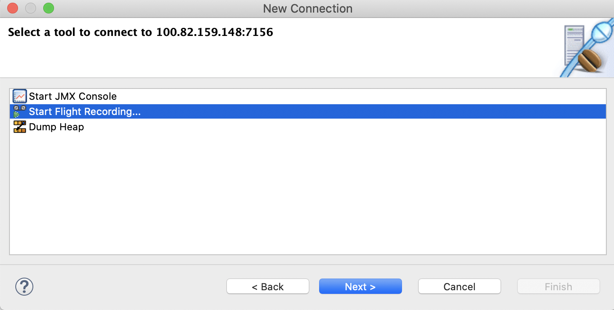
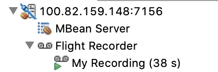
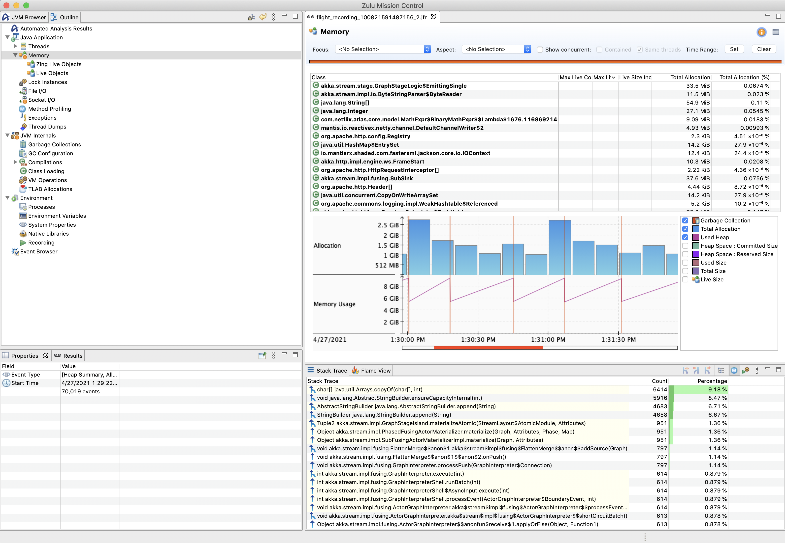

Mantis allows you to directly connect profiling tools to workers in order to do performance or memory profiling. This
can be helpful for debugging OOMs. Below are the steps to start profiling your running Mantis job:

 1. Download a profiling tool. We recommend [Zulu Mission Control (ZMC)](https://www.azul.com/products/zulu-mission-control/).
 1. Untar ZMC
    ```
    tar -xzvf <zulu_mission_control_package>.tar.gz
    ```
 1. Run ZMC.

    !!! note
        On Mac the `Zulu Mission Control` app is actually a directory even though it has an icon.
        The `zmc` executable is inside and needs to be called directly.
    ```
    <your dir>/<zulu_mission_control_package>/Zulu\ Mission\ Control.app/Contents/MacOS/zmc
    ```
 1. Find a worker you want to debug in your job and click on it to get its **ip address** and **debug port** In this
    example these are `100.82.159.148` and `7156` respectively.

    

 1. Setup an SSH tunnel with local portforwarding for your worker and port. The tunnel command for the example worker
    in the previous step would be:
    ```
    ssh -L 7156:127.0.0.1:7156 100.82.159.148
    ```

    !!! note
        Tunneling is only required if you can't access the Mantis worker's ip directly.

 1. After setting up local port forwarding. Add the worker JVM to ZMC by clicking the plug and star icon in the top right corner.

    

 1. Input your mantis worker information

    

 1. Start the flight recorder

    

 1. Wait for the Flight recording to complete

    
    
 1. Look at the collected profiling info. Below is an example of the memory profiling results. You can see the 
    percentage of the heap occuppied by different objects, and some stack profiling information about where the
    allocations happen.
    
    