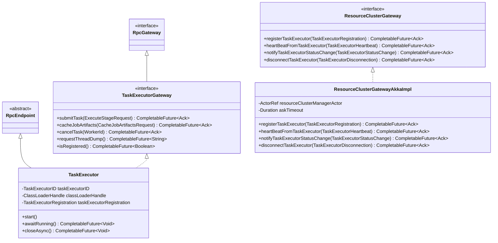

# Mantis Control Plane Core

This module contains core components for the Mantis Control Plane, including the Flink RPC system integration.

## Flink RPC Dependencies

This module directly depends on the Flink RPC libraries:
- `org.apache.flink:flink-rpc-core` (API dependency)
- `org.apache.flink:flink-rpc-akka` (compileOnly dependency, provided by copyLibs task)

## Dependency Graph

The following diagram shows how `org.apache.flink:flink-rpc-akka` and `org.apache.flink:flink-rpc-core` are used in the Mantis project and what modules depend on them:

Note: The dotted line from mantis-control-plane-core to flink-rpc-akka represents a runtime dependency rather than a direct compile-time dependency. The flink-rpc-core module does not directly depend on Akka or Scala libraries, while flink-rpc-akka does.

## Key Classes and Their Relationships

## Usage Pattern

The Flink RPC system is used in Mantis for communication between components, particularly for task execution:

1. **RPC System Loading**:
   - `MantisAkkaRpcSystemLoader` loads the Akka RPC implementation
   - `CleanupOnCloseRpcSystem` wraps the RPC system to clean up resources when closed

2. **Task Executor Communication**:
   - `TaskExecutorGateway` interface extends Flink's `RpcGateway` for task executor communication
   - `TaskExecutor` class implements `TaskExecutorGateway` and extends `RpcEndpoint`

3. **Resource Cluster Management**:
   - `ResourceClusterAkkaImpl` and `ResourceClusterGatewayAkkaImpl` use Akka actors but interact with the Flink RPC system
   - They provide methods to get `TaskExecutorGateway` instances for communication with task executors
